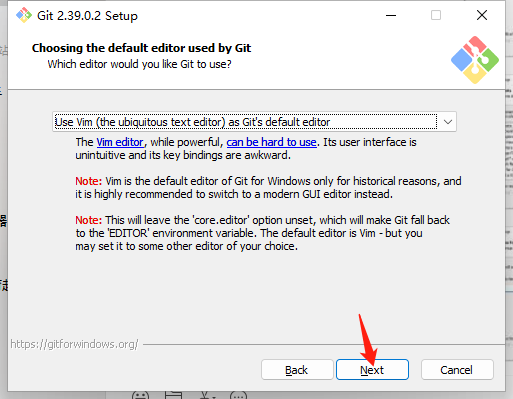
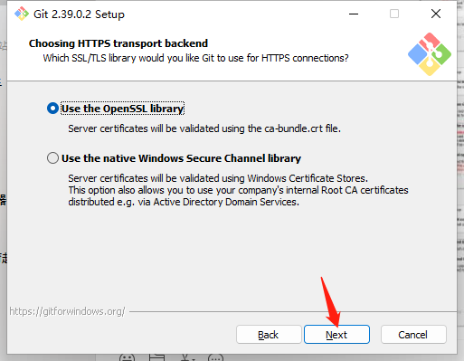
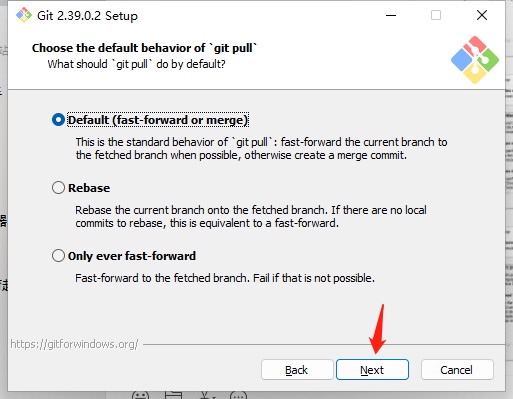
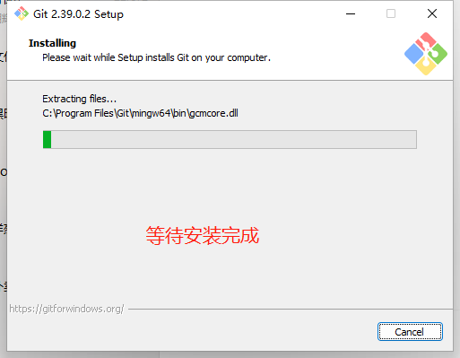

# 安装

- [返回](./README.md)

---

- [官方网站](https://git-scm.com/)
- [点击官方下载](https://git-scm.com/download/win)
- [点击本地下载](https://media.huhuiyu.top/download/Git-64-bit.exe)

<section class="img-flex-box" >
  <section></section>
  <section></section>
  <section></section>
  <section></section>
  <section></section>
  <section></section>
  <section></section>
  <section></section>
  <section></section>
  <section></section>
  <section></section>
  <section></section>
  <section></section>
  <section></section>
  <section></section>
  <section></section>
  <section></section>
  <section></section>
</section>

---

- [安装](#安装)

<!-- js处理背景和css样式 -->

