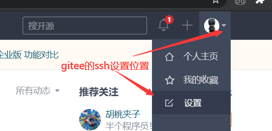
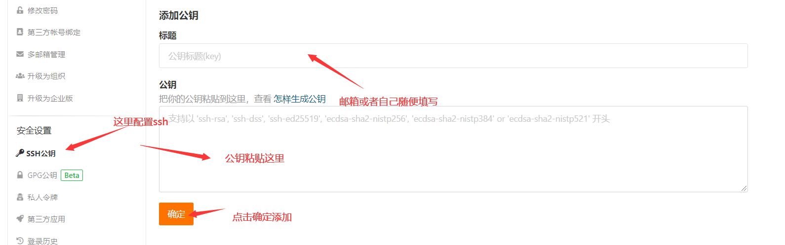

# ssh配置

- [返回](./README.md)

---

- 图中输入的指令(区分大小写，空格也是必须的)
  - 创建密钥`ssh-keygen -t rsa -C "你的邮箱"`
  - 打开密钥所在位置`start ~/.ssh`
  - 密钥不需要反复创建，除非丢失了

<section class="img-flex-box" >
  <section></section>
  <section></section>
  <section></section>
  <section></section>
  <section></section>
  <section></section>
  <section></section>
  <section></section>
</section>

---

- [ssh配置](#ssh配置)

<!-- js处理背景和css样式 -->

