# idea安装和配置

- [idea安装和配置](#idea安装和配置)
  - [安装](#安装)
  - [配置](#配置)

## 安装

- [中文官方网站](https://www.jetbrains.com.cn/idea/)
- [下载页面](https://www.jetbrains.com.cn/idea/download/?section=windows)
- [激活文件下载](../images/files/idea_active.zip)

<section class="img-flex-box" >
  <section>基础文件下载</section>
  <section>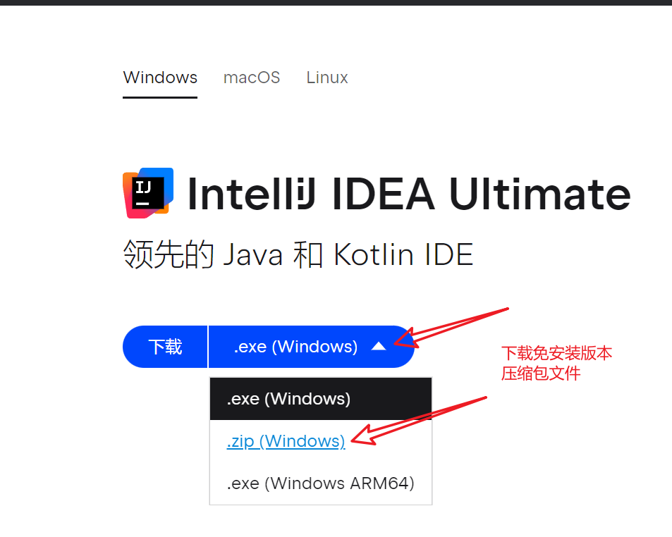</section>
  <section>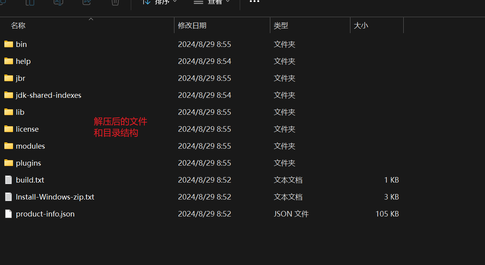</section>
  <section>激活文件下载</section>
  <section>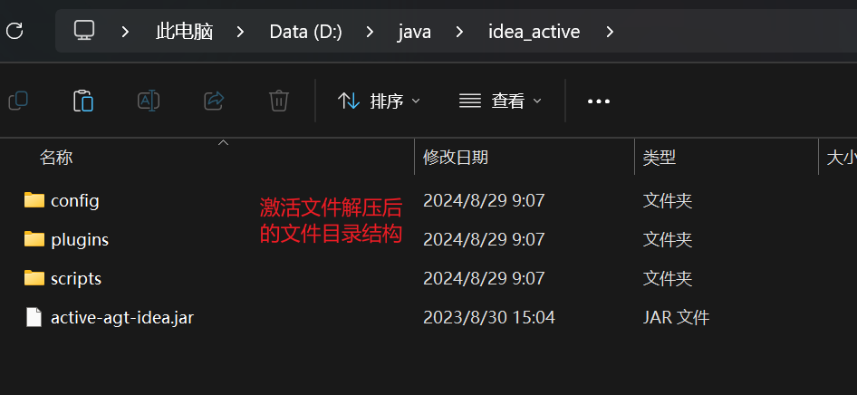</section>
  <section>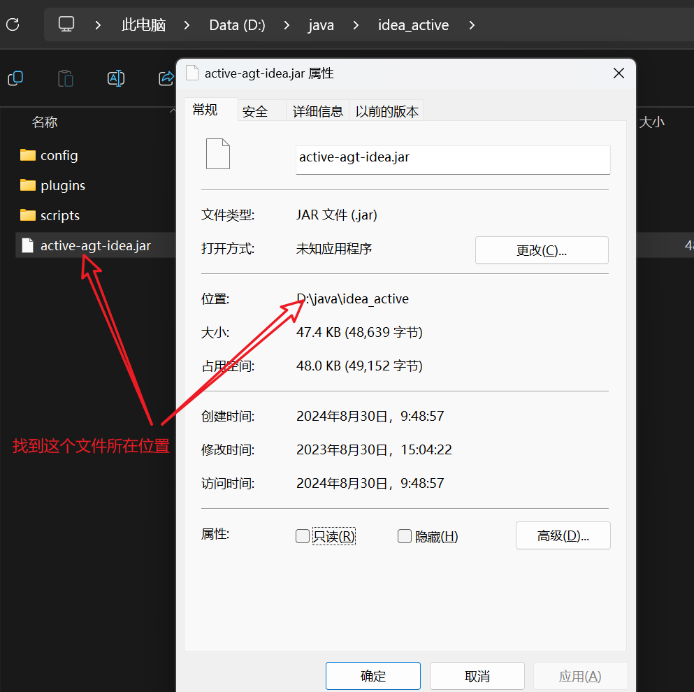</section>
  <section>激活配置</section>
  <section>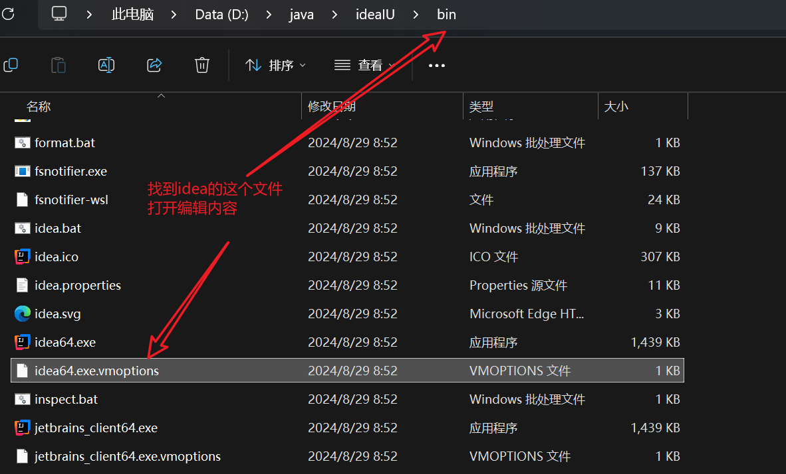</section>
  <section>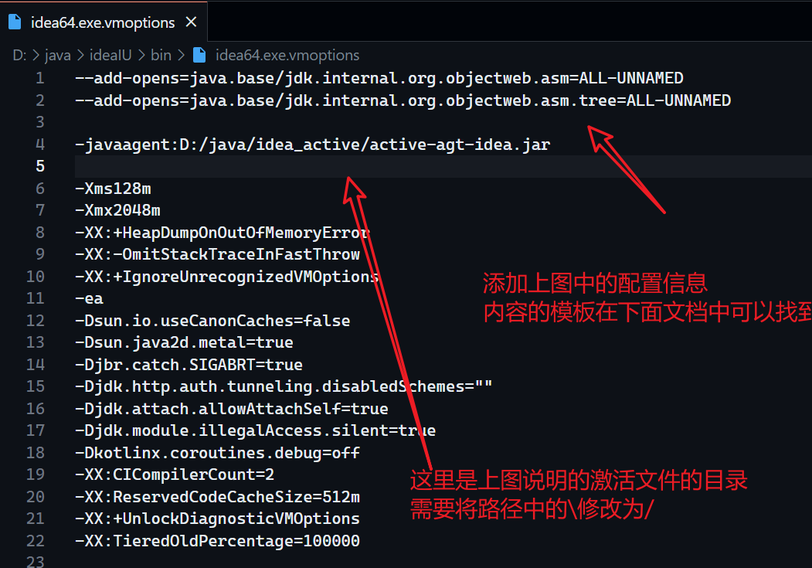</section>
  <section>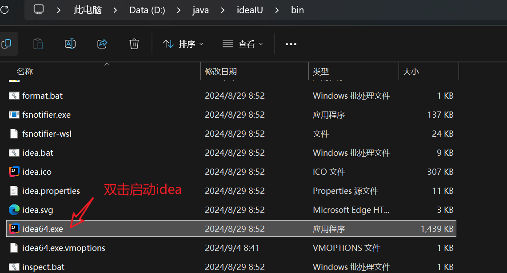</section>
  <section>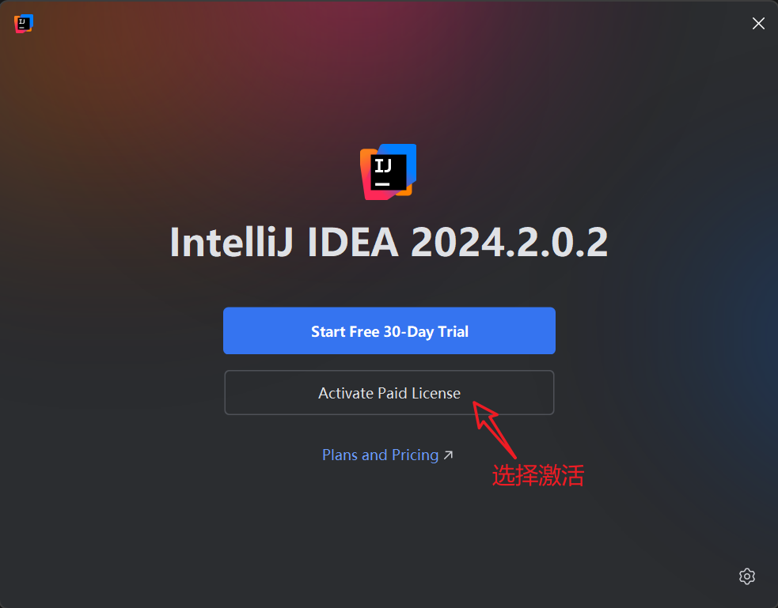</section>
  <section>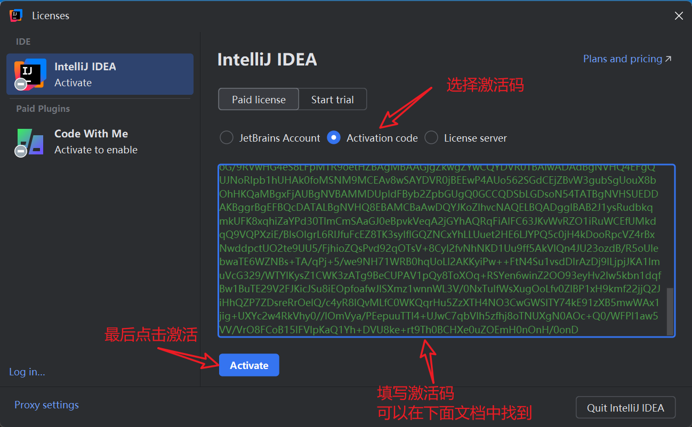</section>
  <section>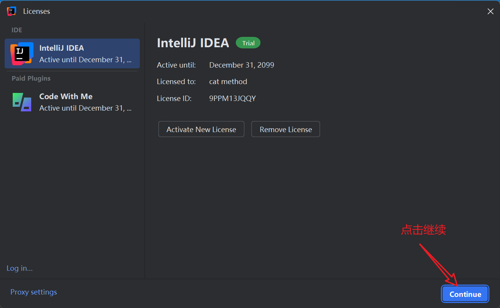</section>
  <section>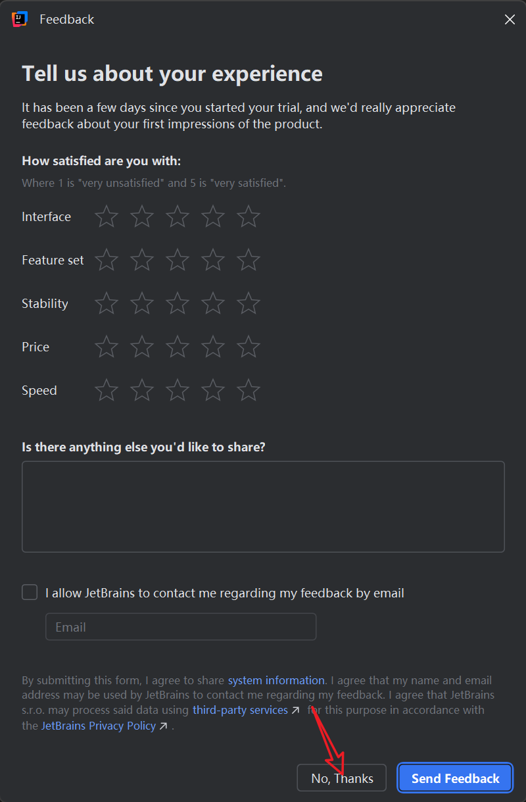</section>
  <section>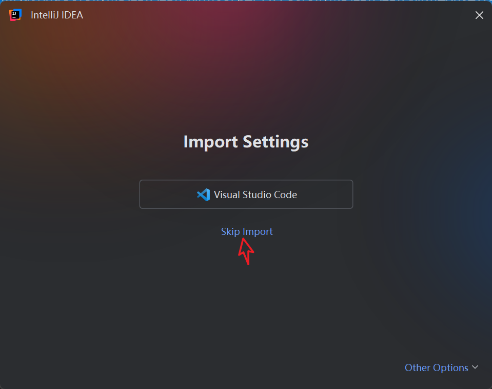</section>
  <section>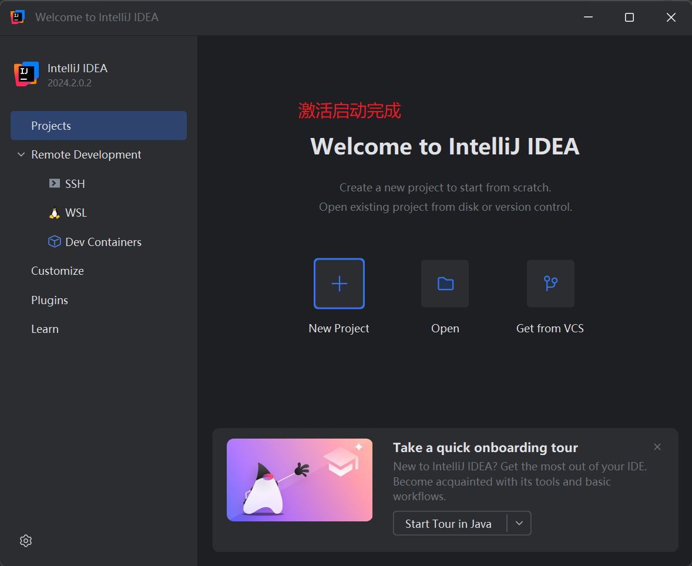</section>

<section class="img-flex-box" >

---配置文件模板---

```ini
--add-opens=java.base/jdk.internal.org.objectweb.asm=ALL-UNNAMED
--add-opens=java.base/jdk.internal.org.objectweb.asm.tree=ALL-UNNAMED

-javaagent:D:/java/idea_active/active-agt-idea.jar
```

---激活码---

```txt
9PPM13JQQY-eyJsaWNlbnNlSWQiOiI5UFBNMTNKUVFZIiwibGljZW5zZWVOYW1lIjoiY2F0IG1ldGhvZCIsImFzc2lnbmVlTmFtZSI6IiIsImFzc2lnbmVlRW1haWwiOiIiLCJsaWNlbnNlUmVzdHJpY3Rpb24iOiIiLCJjaGVja0NvbmN1cnJlbnRVc2UiOmZhbHNlLCJwcm9kdWN0cyI6W3siY29kZSI6IlBXUyIsImZhbGxiYWNrRGF0ZSI6IjIwMjMtMDYtMDEiLCJwYWlkVXBUbyI6IjIwMjMtMDYtMDEiLCJleHRlbmRlZCI6dHJ1ZX0seyJjb2RlIjoiUERCIiwiZmFsbGJhY2tEYXRlIjoiMjAyMy0wNi0wMSIsInBhaWRVcFRvIjoiMjAyMy0wNi0wMSIsImV4dGVuZGVkIjp0cnVlfSx7ImNvZGUiOiJQU1ciLCJmYWxsYmFja0RhdGUiOiIyMDIzLTA2LTAxIiwicGFpZFVwVG8iOiIyMDIzLTA2LTAxIiwiZXh0ZW5kZWQiOnRydWV9LHsiY29kZSI6IlBSQiIsImZhbGxiYWNrRGF0ZSI6IjIwMjMtMDYtMDEiLCJwYWlkVXBUbyI6IjIwMjMtMDYtMDEiLCJleHRlbmRlZCI6dHJ1ZX0seyJjb2RlIjoiUFNJIiwiZmFsbGJhY2tEYXRlIjoiMjAyMy0wNi0wMSIsInBhaWRVcFRvIjoiMjAyMy0wNi0wMSIsImV4dGVuZGVkIjp0cnVlfSx7ImNvZGUiOiJQR08iLCJmYWxsYmFja0RhdGUiOiIyMDIzLTA2LTAxIiwicGFpZFVwVG8iOiIyMDIzLTA2LTAxIiwiZXh0ZW5kZWQiOnRydWV9LHsiY29kZSI6IlBQUyIsImZhbGxiYWNrRGF0ZSI6IjIwMjMtMDYtMDEiLCJwYWlkVXBUbyI6IjIwMjMtMDYtMDEiLCJleHRlbmRlZCI6dHJ1ZX0seyJjb2RlIjoiUFBDIiwiZmFsbGJhY2tEYXRlIjoiMjAyMy0wNi0wMSIsInBhaWRVcFRvIjoiMjAyMy0wNi0wMSIsImV4dGVuZGVkIjp0cnVlfSx7ImNvZGUiOiJQQ1dNUCIsImZhbGxiYWNrRGF0ZSI6IjIwMjMtMDYtMDEiLCJwYWlkVXBUbyI6IjIwMjMtMDYtMDEiLCJleHRlbmRlZCI6dHJ1ZX0seyJjb2RlIjoiSUkiLCJmYWxsYmFja0RhdGUiOiIyMDIzLTA2LTAxIiwicGFpZFVwVG8iOiIyMDIzLTA2LTAxIiwiZXh0ZW5kZWQiOmZhbHNlfV0sIm1ldGFkYXRhIjoiMDEyMDIyMDYwMVBTQU4wMDAwMDUiLCJoYXNoIjoiVFJJQUw6LTE5NzMwODYzMiIsImdyYWNlUGVyaW9kRGF5cyI6NywiYXV0b1Byb2xvbmdhdGVkIjpmYWxzZSwiaXNBdXRvUHJvbG9uZ2F0ZWQiOmZhbHNlfQ==-P0n5WNbm7POecGXoOAsmSv9RVkBrrKm5PvBN59x/mXNvetWjgbQf6p926HduPz58bg+3SdpPDPWkcWtY06El7L/XXZVvWwKwlvdR6Vkhy1+GRiuu56Ix1JBO9cM1evwDYW21wpr0KMJ3zaLA6Vi9BUm/N8a39G4PaZn+rVdSjVwRFjF7bt5rIqOktkLe7UM6os5Z4RxcX7h7/rpVlpPwlg1teMu/+BLaP7AzFZNLY58HUJhub00TaYoOVuiYu+WozZIIBHdrmPWnS372qV2Vu+NZPksjlTqcxXM8LOhuZcuFZtlVsXMrgIoxUni+FRjwf57BYADXfhxX+iOl3kh2uQ==-MIIETDCCAjSgAwIBAgIBDTANBgkqhkiG9w0BAQsFADAYMRYwFAYDVQQDDA1KZXRQcm9maWxlIENBMB4XDTIwMTAxOTA5MDU1M1oXDTIyMTAyMTA5MDU1M1owHzEdMBsGA1UEAwwUcHJvZDJ5LWZyb20tMjAyMDEwMTkwggEiMA0GCSqGSIb3DQEBAQUAA4IBDwAwggEKAoIBAQCUlaUFc1wf+CfY9wzFWEL2euKQ5nswqb57V8QZG7d7RoR6rwYUIXseTOAFq210oMEe++LCjzKDuqwDfsyhgDNTgZBPAaC4vUU2oy+XR+Fq8nBixWIsH668HeOnRK6RRhsr0rJzRB95aZ3EAPzBuQ2qPaNGm17pAX0Rd6MPRgjp75IWwI9eA6aMEdPQEVN7uyOtM5zSsjoj79Lbu1fjShOnQZuJcsV8tqnayeFkNzv2LTOlofU/Tbx502Ro073gGjoeRzNvrynAP03pL486P3KCAyiNPhDs2z8/COMrxRlZW5mfzo0xsK0dQGNH3UoG/9RVwHG4eS8LFpMTR9oetHZBAgMBAAGjgZkwgZYwCQYDVR0TBAIwADAdBgNVHQ4EFgQUJNoRIpb1hUHAk0foMSNM9MCEAv8wSAYDVR0jBEEwP4AUo562SGdCEjZBvW3gubSgUouX8bOhHKQaMBgxFjAUBgNVBAMMDUpldFByb2ZpbGUgQ0GCCQDSbLGDsoN54TATBgNVHSUEDDAKBggrBgEFBQcDATALBgNVHQ8EBAMCBaAwDQYJKoZIhvcNAQELBQADggIBAB2J1ysRudbkqmkUFK8xqhiZaYPd30TlmCmSAaGJ0eBpvkVeqA2jGYhAQRqFiAlFC63JKvWvRZO1iRuWCEfUMkdqQ9VQPXziE/BlsOIgrL6RlJfuFcEZ8TK3syIfIGQZNCxYhLLUuet2HE6LJYPQ5c0jH4kDooRpcVZ4rBxNwddpctUO2te9UU5/FjhioZQsPvd92qOTsV+8Cyl2fvNhNKD1Uu9ff5AkVIQn4JU23ozdB/R5oUlebwaTE6WZNBs+TA/qPj+5/we9NH71WRB0hqUoLI2AKKyiPw++FtN4Su1vsdDlrAzDj9ILjpjJKA1ImuVcG329/WTYIKysZ1CWK3zATg9BeCUPAV1pQy8ToXOq+RSYen6winZ2OO93eyHv2Iw5kbn1dqfBw1BuTE29V2FJKicJSu8iEOpfoafwJISXmz1wnnWL3V/0NxTulfWsXugOoLfv0ZIBP1xH9kmf22jjQ2JiHhQZP7ZDsreRrOeIQ/c4yR8IQvMLfC0WKQqrHu5ZzXTH4NO3CwGWSlTY74kE91zXB5mwWAx1jig+UXYc2w4RkVhy0//lOmVya/PEepuuTTI4+UJwC7qbVlh5zfhj8oTNUXgN0AOc+Q0/WFPl1aw5VV/VrO8FCoB15lFVlpKaQ1Yh+DVU8ke+rt9Th0BCHXe0uZOEmH0nOnH/0onD
```

</section>

## 配置

<!-- js处理背景和css样式 -->
<script type="module" src="/js/github.js"></script>
