# putty

- [返回](./README.md)

---

- [putty](#putty)
  - [安装putty](#安装putty)
  - [ssh配置之putty密钥生成](#ssh配置之putty密钥生成)
  - [ssh配置之服务端配置](#ssh配置之服务端配置)

## 安装putty

- [官方网站](https://putty.org/)
- [点击官方下载](https://the.earth.li/~sgtatham/putty/latest/w64/putty-64bit-0.78-installer.msi)
- [点击本地下载](https://media.huhuiyu.top/download/putty-64bit-0.78-installer.msi)

<section class="img-flex-box" >
  <section>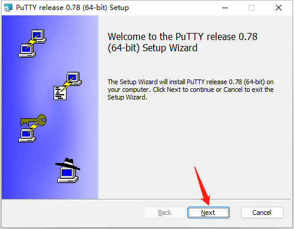</section>
  <section>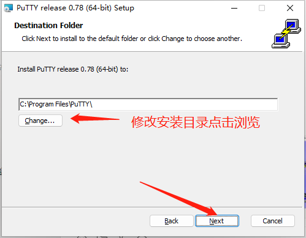</section>
  <section>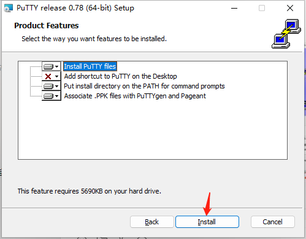</section>
  <section>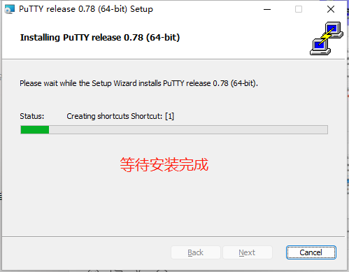</section>
  <section>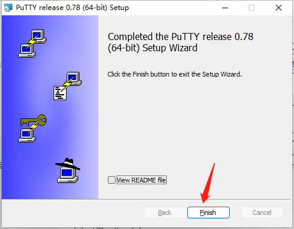</section>
  <section>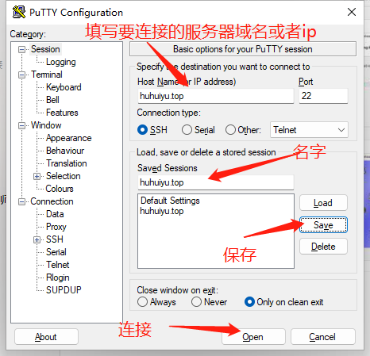</section>
</section>

- [putty](#putty)
  - [安装putty](#安装putty)
  - [ssh配置之putty密钥生成](#ssh配置之putty密钥生成)
  - [ssh配置之服务端配置](#ssh配置之服务端配置)

## ssh配置之putty密钥生成

<section class="img-flex-box" >
  <section>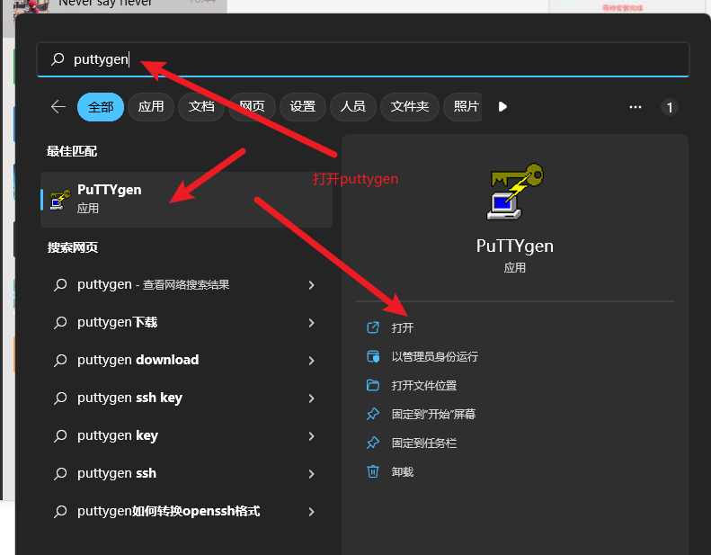</section>
  <section>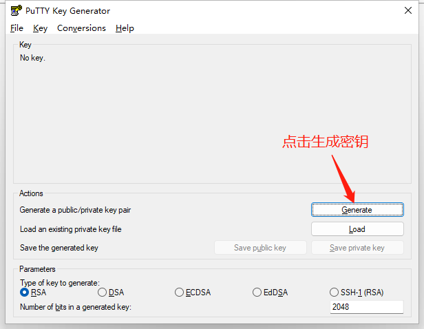</section>
  <section>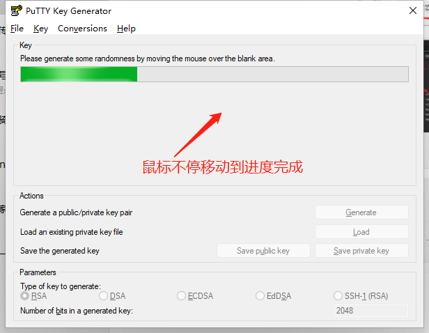</section>
  <section>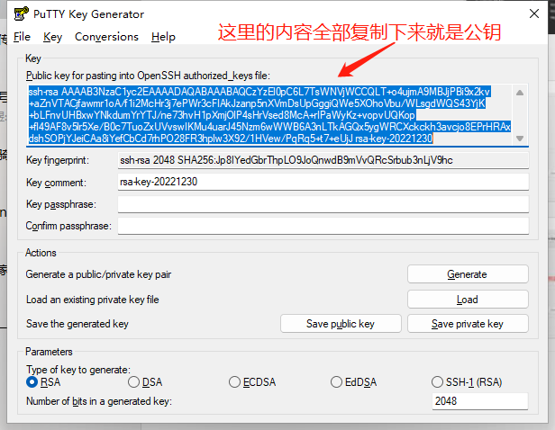</section>
  <section>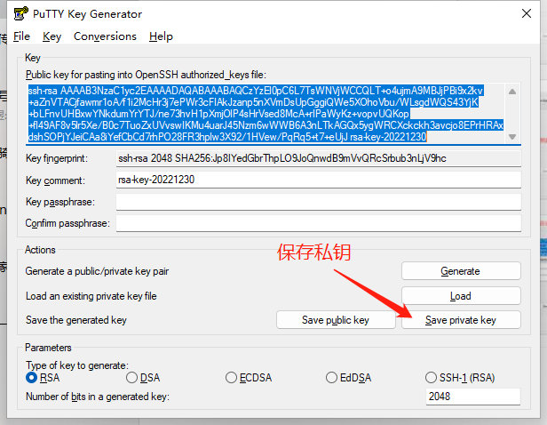</section>
  <section>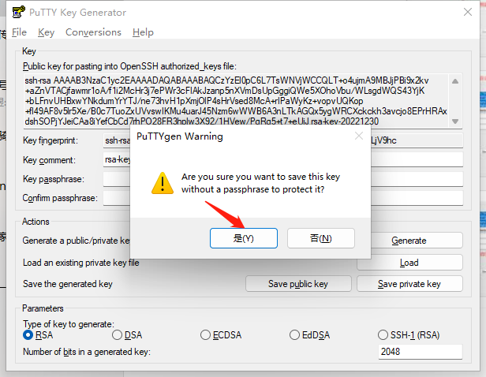</section>
  <section>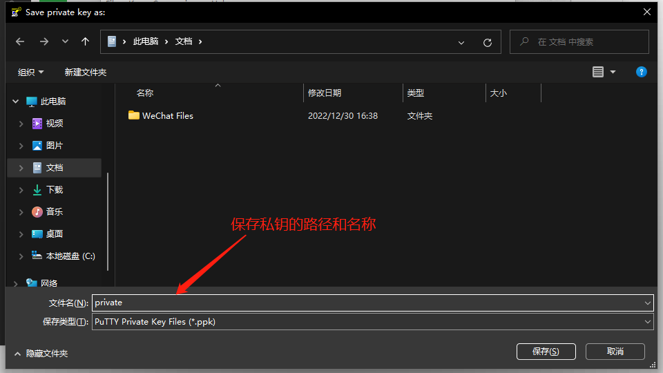</section>
  <section>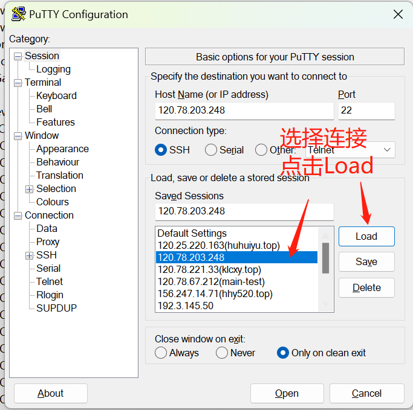</section>
  <section>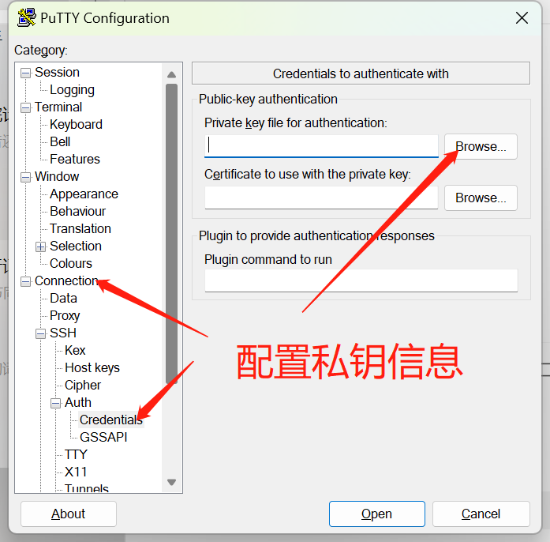</section>
  <section>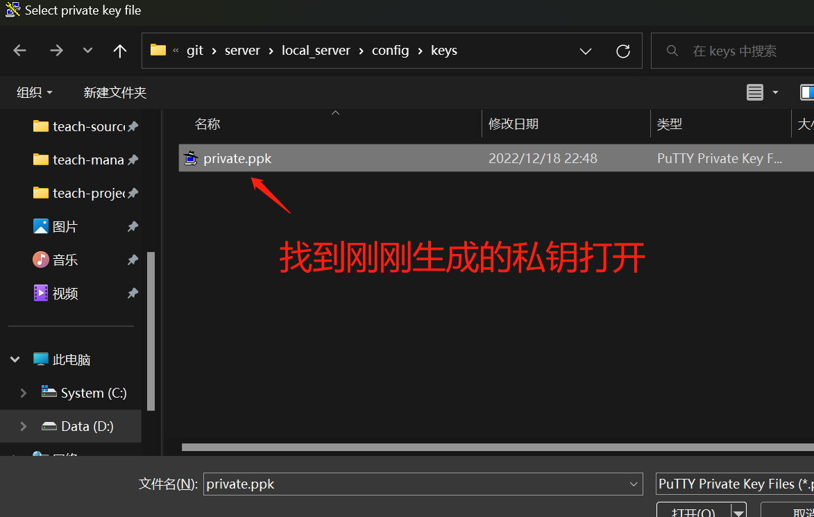</section>
  <section>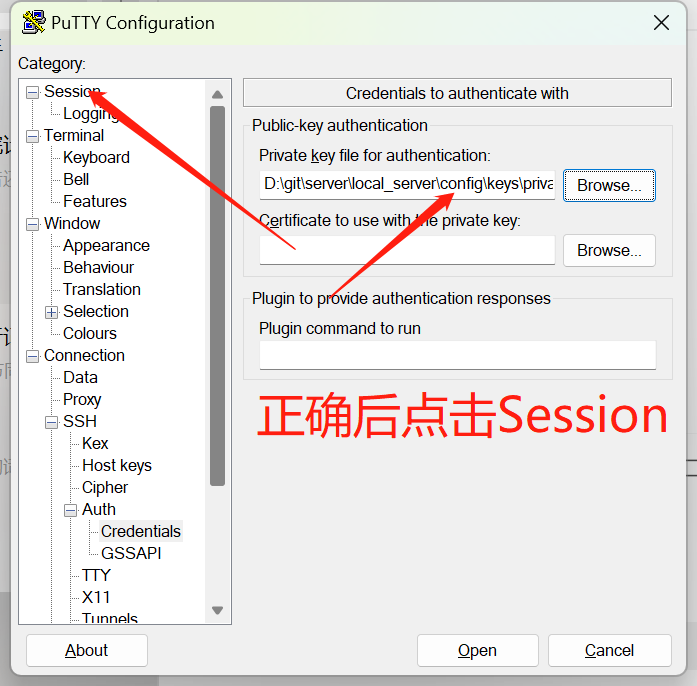</section>
  <section>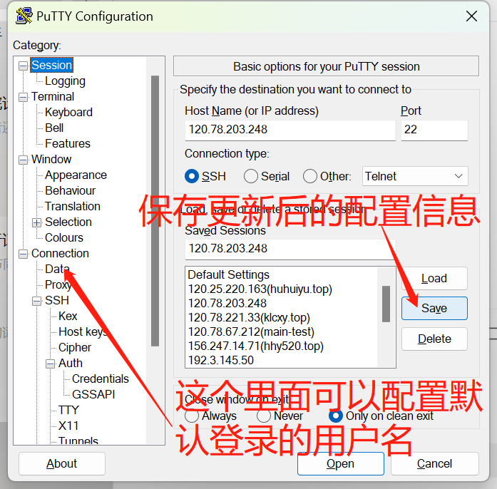</section>
</section>

- [putty](#putty)
  - [安装putty](#安装putty)
  - [ssh配置之putty密钥生成](#ssh配置之putty密钥生成)
  - [ssh配置之服务端配置](#ssh配置之服务端配置)

## ssh配置之服务端配置

- 图中的指令
  - `mkdir ~/.ssh`
  - `chmod 700 ~/.ssh`
  - `vi ~/.ssh/authorized_keys`
  - `chmod 600 ~/.ssh/authorized_keys`

<section class="img-flex-box" >
  <section>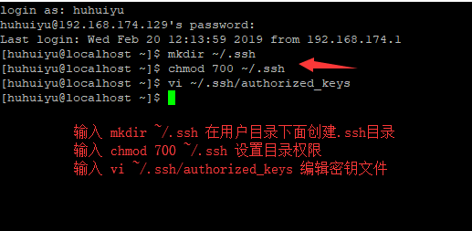</section>
  <section>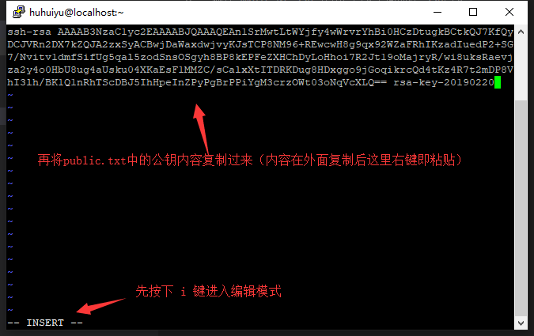</section>
  <section>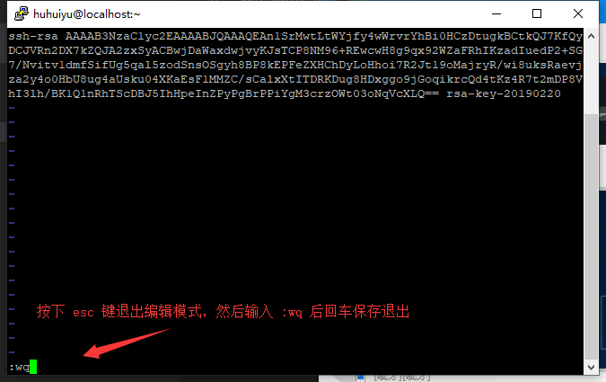</section>
  <section>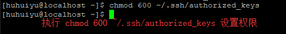</section>
</section>

- 拒绝使用密码登录-一旦开启，!!!丢失ssh密钥将无法登录!!!
  - 执行`vi /etc/ssh/sshd_config`配置ssh
  - 输入`/PasswordAuthentication`回车找到对应配置项
  - 修改为`PasswordAuthentication no`拒绝使用密码登陆
  - 执行`systemctl restart sshd.service`重启ssh服务生效

---

- [putty](#putty)
  - [安装putty](#安装putty)
  - [ssh配置之putty密钥生成](#ssh配置之putty密钥生成)
  - [ssh配置之服务端配置](#ssh配置之服务端配置)

<!-- js处理背景和css样式 -->

