# ms-office安装

- [返回](./README.md)

---

- [夸克网盘分享链接](https://pan.quark.cn/s/20d30549b609)

<section class="img-flex-box" >
  <section>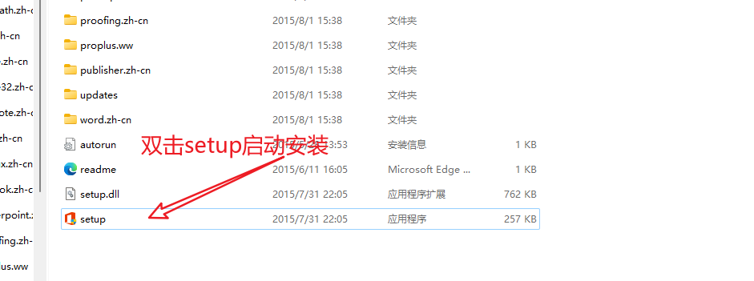</section>
  <section>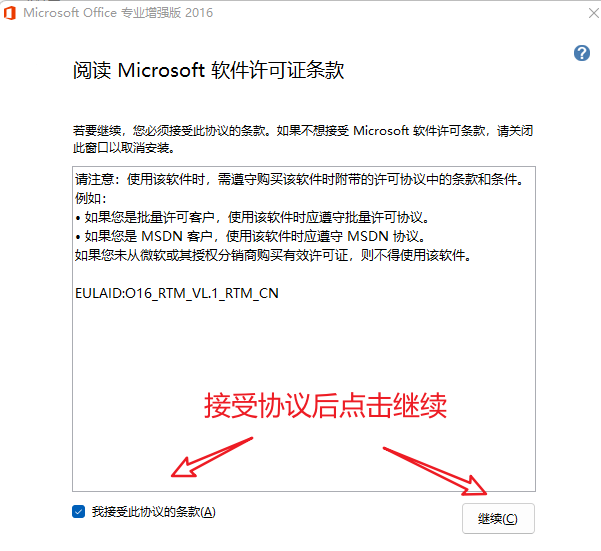</section>
  <section>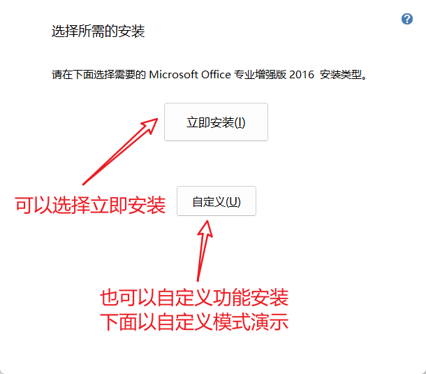</section>
  <section>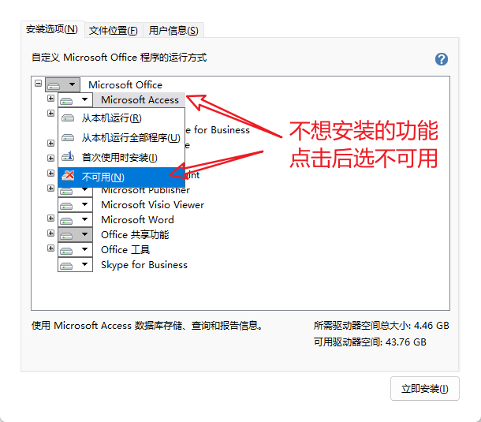</section>
  <section>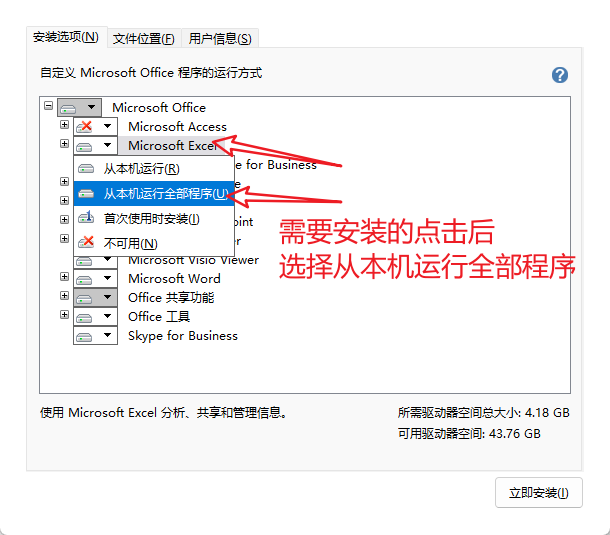</section>
  <section>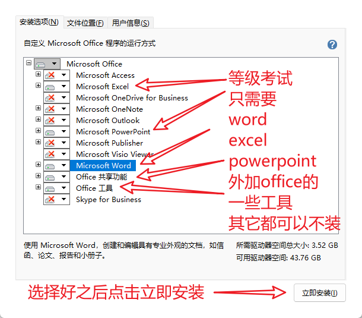</section>
  <section>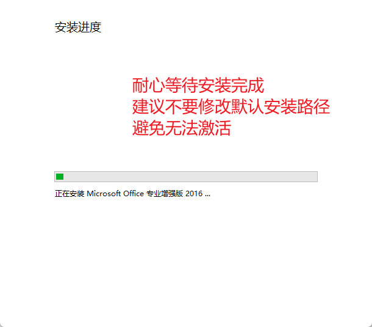</section>
  <section>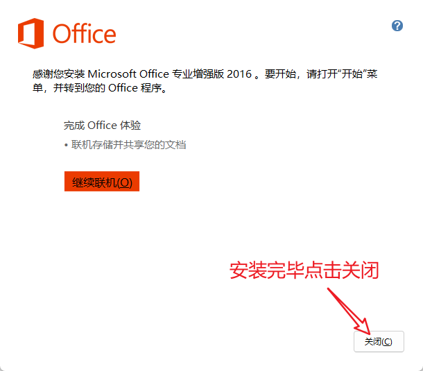</section>
  <section>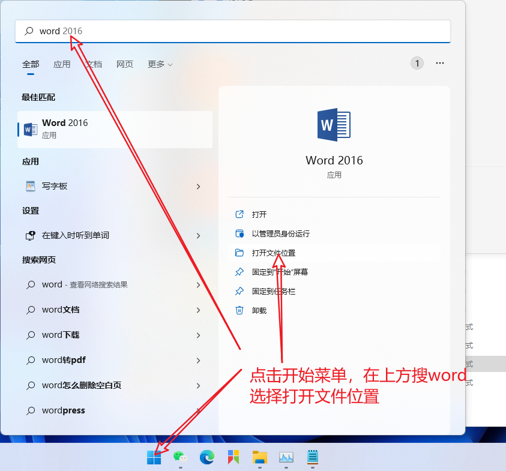</section>
  <section>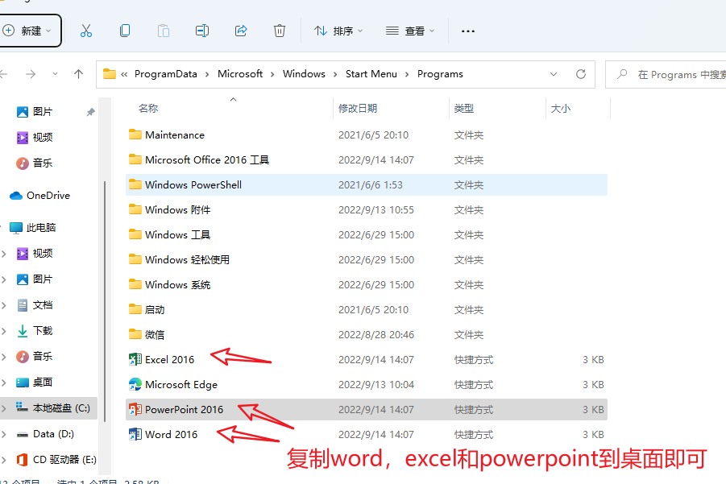</section>
</section>

- [下载激活脚本](https://media.huhuiyu.top/download/office2016.bat)

<section class="img-flex-box" >
  <section>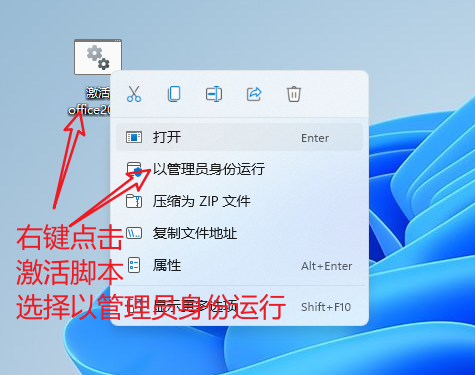</section>
  <section>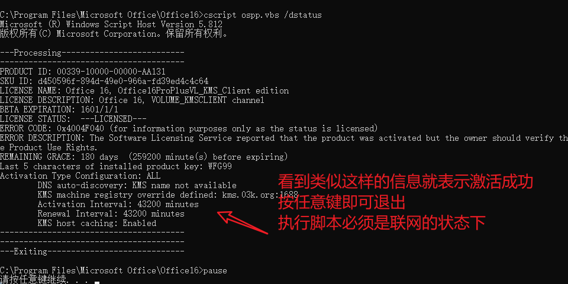</section>
  <section>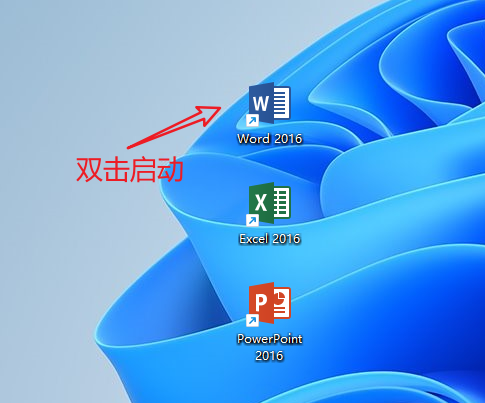</section>
  <section>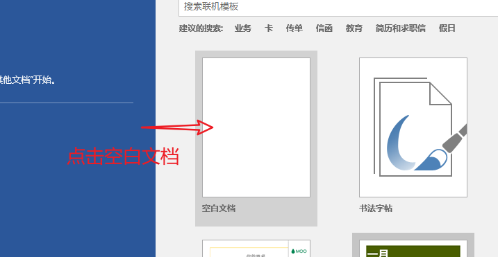</section>
  <section>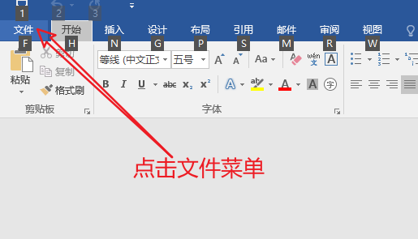</section>
  <section>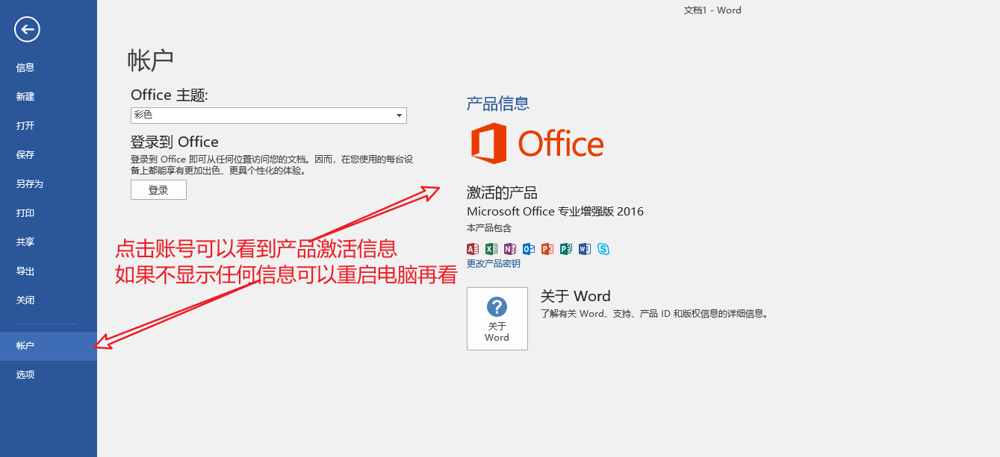</section>
</section>

---

- [ms-office安装](#ms-office安装)

<!-- js处理背景和css样式 -->

