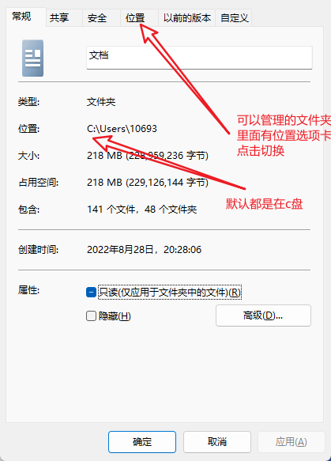

# 用户文件夹设置

- [返回](./README.md)

---

- 显示用户文件夹

<section class="img-flex-box" >
  <section></section>
  <section></section>
  <section></section>
  <section></section>
  <section></section>
  <section></section>
</section>

- 移动用户文件夹

```text
!!!移动用户文件夹!!!
为什么要移动：因为默认都在C盘，一旦系统重装，文件都会丢失
有哪些常见文件会在这里面：桌面的文件，微信qq聊天相关文件，默认下载路径等等
移动的先决条件：硬盘或者分区有多个，简单的说就是除了C盘还有D盘E盘这样的
警告：不要移动到磁盘的根目录，不同的功能文件夹要在不同的路径，否则无法正常工作，且无法恢复
```

<section class="img-flex-box" >
  <section></section>
  <section></section>
  <section></section>
  <section></section>
  <section></section>
  <section></section>
</section>

---

- [用户文件夹设置](#用户文件夹设置)

<!-- js处理背景和css样式 -->
<script type="module" src="https://huhuiyu.top/js/github.js"></script>
