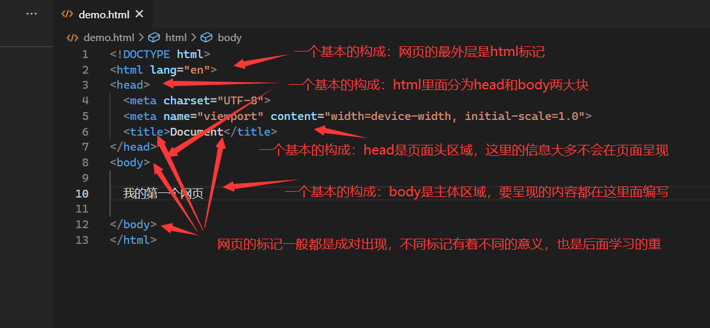
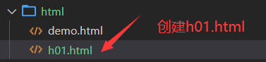
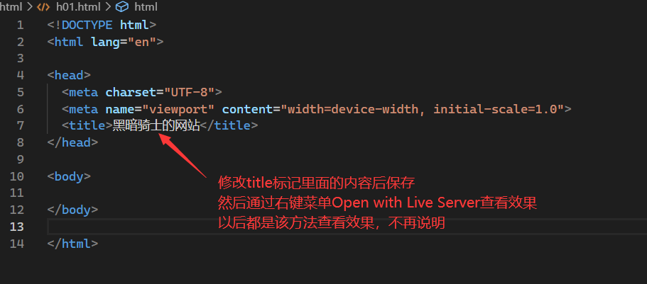
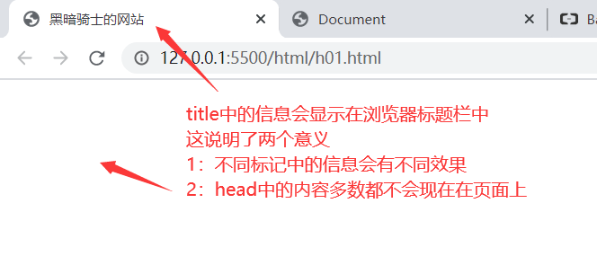
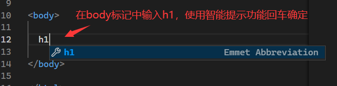
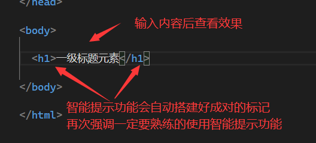
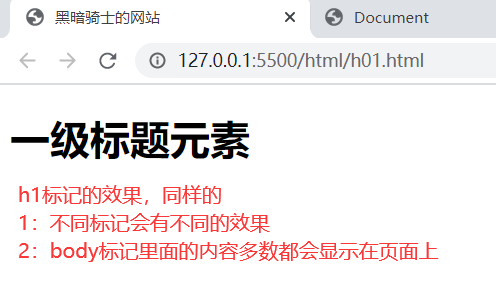
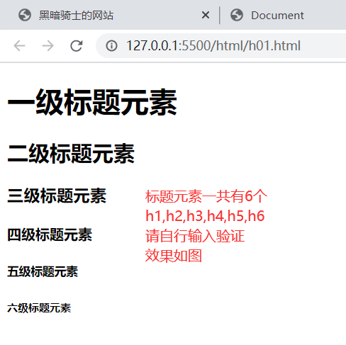
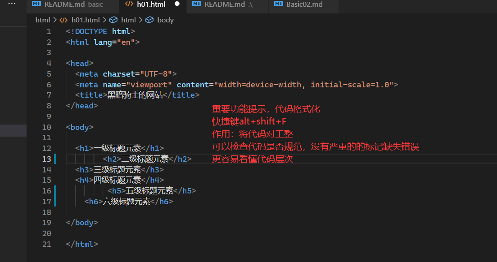
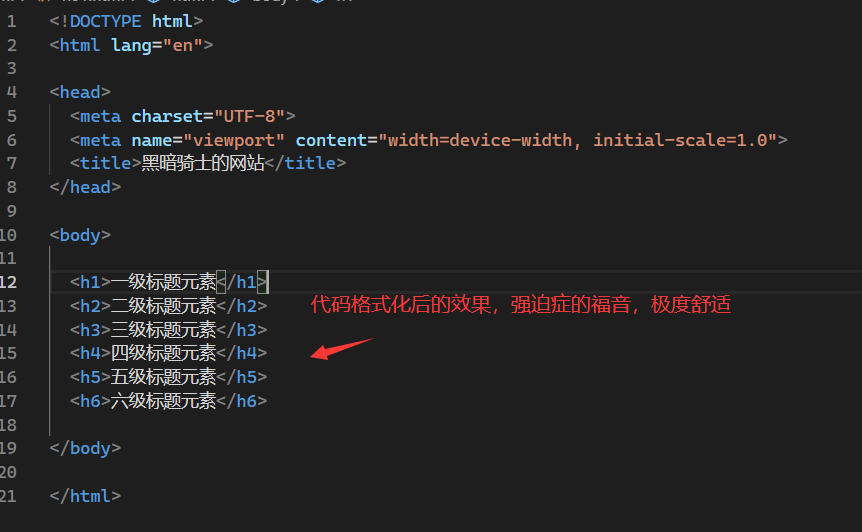

# 网页基本模板

- [返回目录](./README.md)

---

<section class="img-flex-box" >
  <section></section>
  <section></section>
  <section></section>
  <section></section>
  <section></section>
  <section></section>
  <section></section>
  <section></section>
  <section></section>
  <section></section>
</section>

---

- [网页基本模板](#网页基本模板)

<!-- js处理背景和css样式 -->

