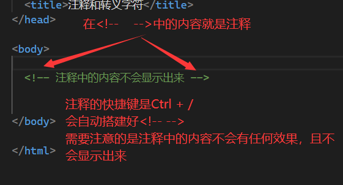
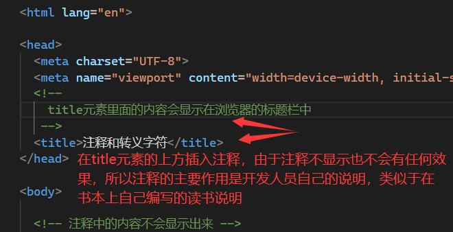
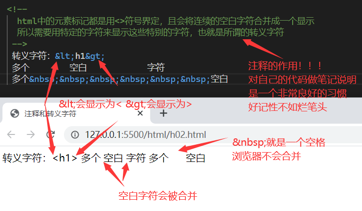
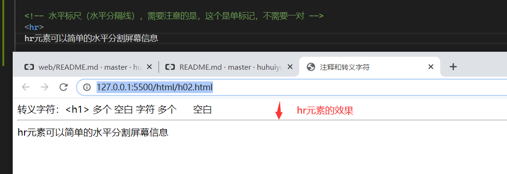
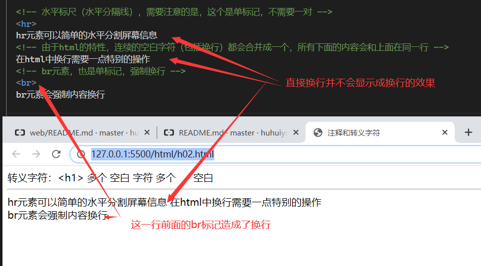
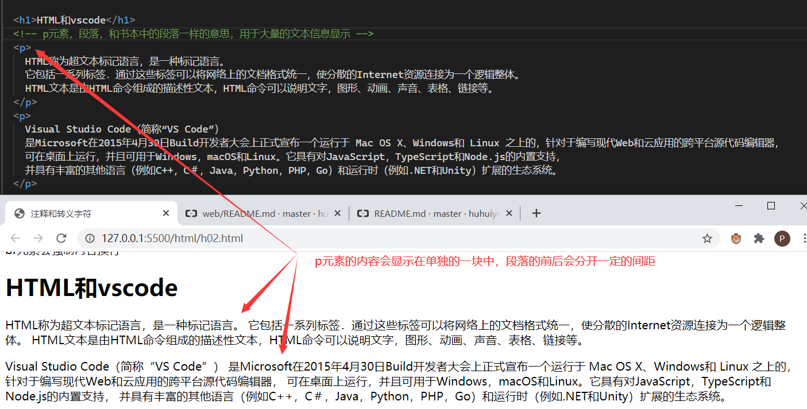

# 注释和转义字符

- [返回目录](/web/basic/README.md)

---

<section class="img-flex-box" >
  <section></section>
  <section></section>
  <section></section>
</section>

```txt
一些常见转义字符：
  双引号"：&quot;
  小于号<：&lt;
  大于号>：&gt;
  &符合：&amp;
  空格：&nbsp;
  版权所有符合：&reg;
```

- [html转义字符表](https://tool.oschina.net/commons?type=2)

<section class="img-flex-box" >
  <section></section>
  <section></section>
  <section></section>
</section>

---

- [注释和转义字符](#注释和转义字符)

<!-- js处理背景和css样式 -->
<script type="module" src="https://huhuiyu.top/js/github.js"></script>
