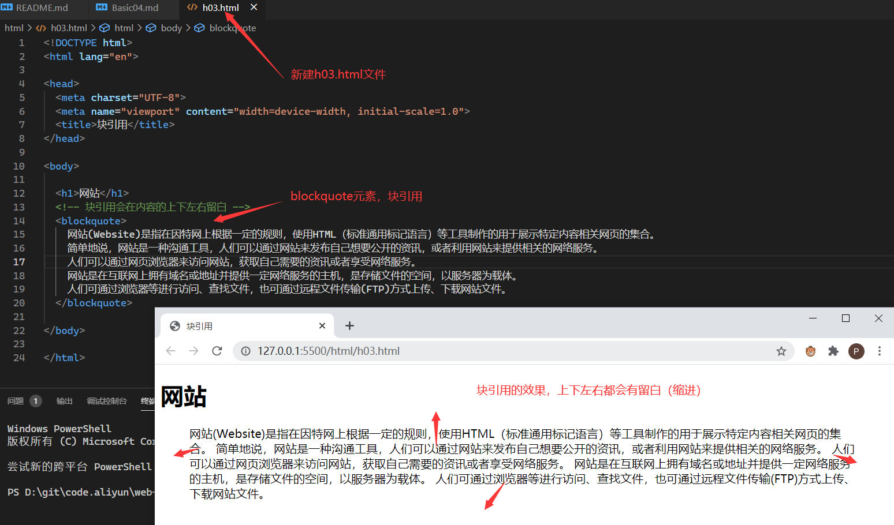
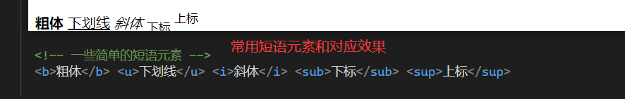
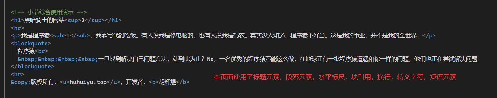
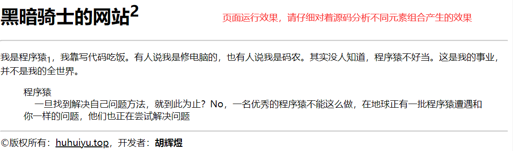
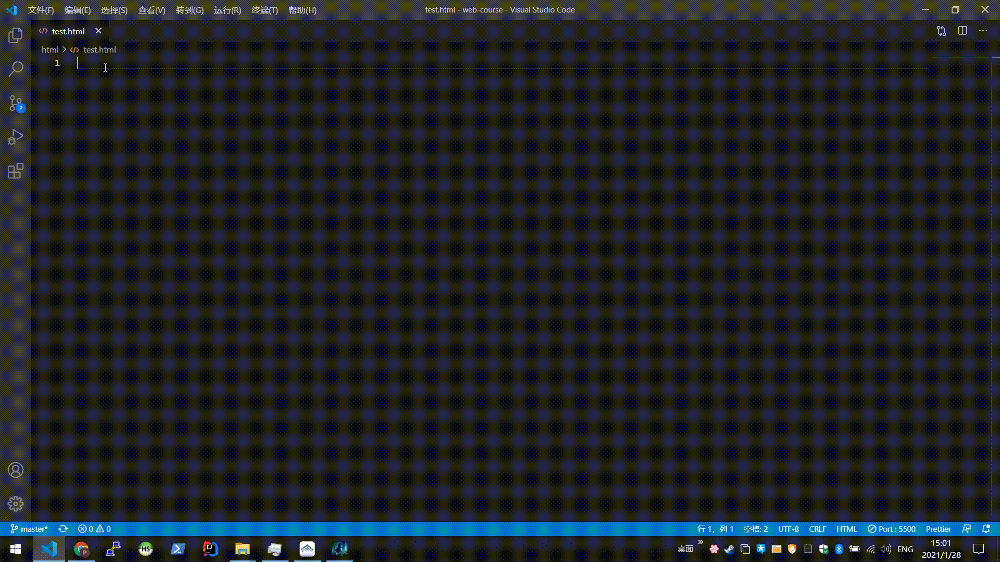

# 块引用

[返回目录](/web/basic/README.md)

---

<section class="img-flex-box" >
  <section></section>
  <section></section>
  <section></section>
  <section></section>
</section>

```txt
元素：
  浏览器标题：title
  标题：h1,h2,h3,h4,h5,h6
  水平标尺：hr
  换行：br
  段落：p
  块引用：blockquote
  短语元素：b,u,i,sub,sup
快捷键：
  保存：CTRL + S
  格式化代码：ALT + SHIFT + F
技巧：
  善用智能提示来编写代码（查看下方图片演示）
```

<section class="img-flex-box" >
  <section></section>
</section>

---

[返回顶端](#块引用)

<!-- js处理背景和css样式 -->
<script type="module" src="https://huhuiyu.top/js/github.js"></script>
