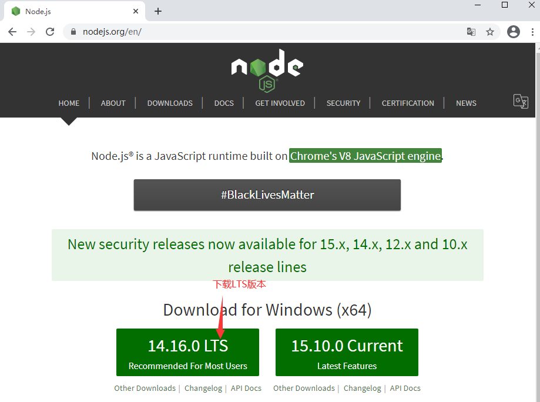
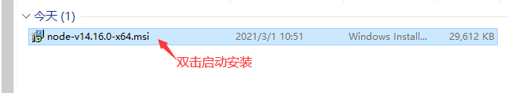
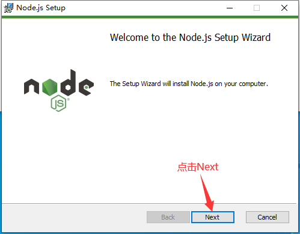
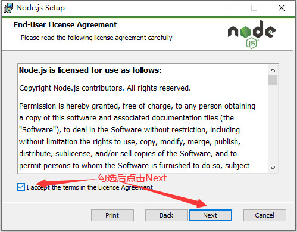
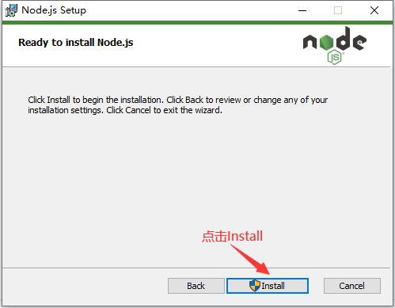
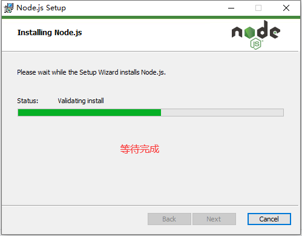
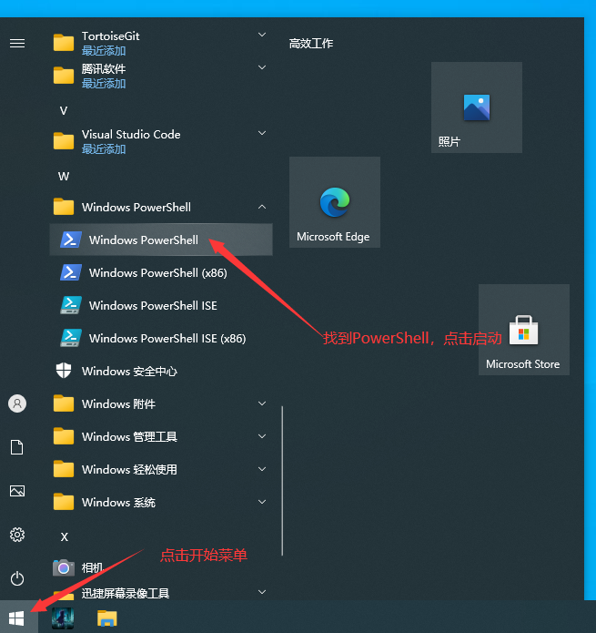

# nodejs安装

- [返回目录](./README.md)

---

- [nodejs官方网址](https://nodejs.org/en/)

<section class="img-flex-box" >
  <section></section>
  <section></section>
  <section></section>
  <section></section>
  <section></section>
  <section></section>
  <section></section>
  <section></section>
  <section></section>
  <section></section>
  <section></section>
  <section></section>
</section>

- 图中的指令
  - `node -v`查看nodejs版本
  - `npm -v`查看npm版本
- 修改全局安装和缓存配置
  - 修改npm全局安装位置：`npm config set prefix "全局安装路径"`
  - 修改npm全局缓存位置：`npm config set cache "全局缓存路径"`
  - 查看配置信息：`npm config ls`
  - 最后修改环境变量，添加全局安装路径

---

- [nodejs安装](#nodejs安装)

<!-- js处理背景和css样式 -->

