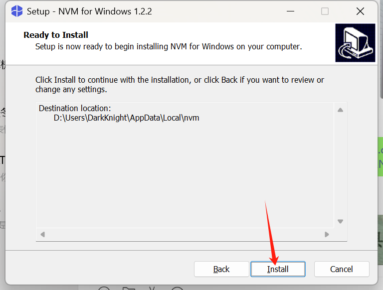

# nvm工具

- [返回目录](./README.md)
  
---

- [nvm工具](#nvm工具)
  - [安装](#安装)
  - [配置阿里镜像](#配置阿里镜像)
  - [常用指令](#常用指令)

## 安装

---

- [点击下载windows版本nvm安装文件](https://github.com/coreybutler/nvm-windows/releases/download/1.2.2/nvm-setup.exe)
- [官方网站](https://github.com/coreybutler/nvm-windows/releases)

<section class="img-flex-box" >
  <section></section>
  <section></section>
  <section></section>
  <section></section>
  <section></section>
  <section></section>
  <section></section>
  <section></section>
  <section></section>
</section>

---

## 配置阿里镜像

- 用管理员身份打开Powershell，执行`nvm node_mirror https://npmmirror.com/mirrors/node/`
- 用管理员身份打开Powershell，执行`nvm npm_mirror https://npmmirror.com/mirrors/npm/`

## 常用指令

- 查看命令帮助`nvm --help`
- 查看可以安装的版本`nvm list available`
- 安装版本`nvm install 22.16.0`，这里的版本号就是上面里面中选取，最好是选择lts版本，或者是前端项目所需版本号
- 显示已经安装的nodejs`nvm list`，如果有切换过当前使用的版本，该版本前面会显示*
- 切换版本`nvm use 22.16.0`
- nodejs的使用和配置请参考[nodejs](./nodejs.md)和[nodejs配置安装源](./nodejs-config.md)

---

- [nvm工具](#nvm工具)
  - [安装](#安装)
  - [配置阿里镜像](#配置阿里镜像)
  - [常用指令](#常用指令)

<!-- js处理背景和css样式 -->

