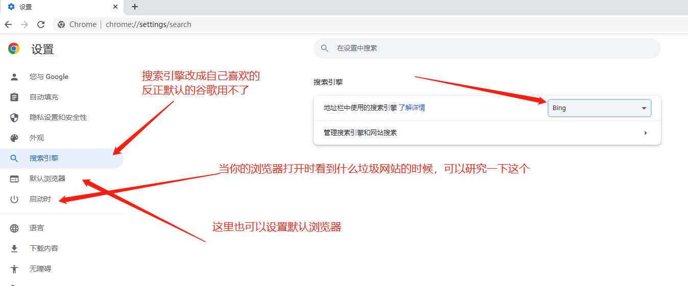

# 谷歌浏览器

- [返回](./README.md)

---

- [官方网站](https://www.google.cn/chrome/index.html)
- [本地下载](https://media.huhuiyu.top/download/ChromeSetup.exe)

<section class="img-flex-box" >
  <section></section>
</section>

- 这里省略启动安装，下载，等待的过程...

<section class="img-flex-box" >
  <section></section>
  <section></section>
  <section></section>
  <section></section>
  <section></section>
  <section></section>
</section>

- 如果浏览器主页是奇奇怪怪的页面，还替换不了，那么：

<section class="img-flex-box" >
  <section></section>
  <section></section>
  <section></section>
  <section></section>
</section>

---

- [谷歌浏览器](#谷歌浏览器)

<!-- js处理背景和css样式 -->

