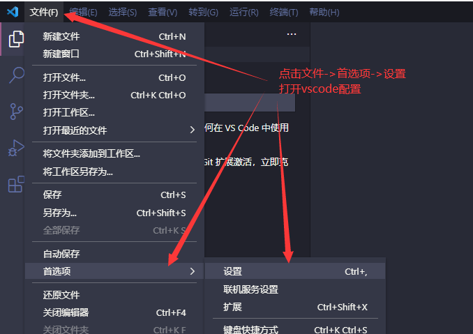
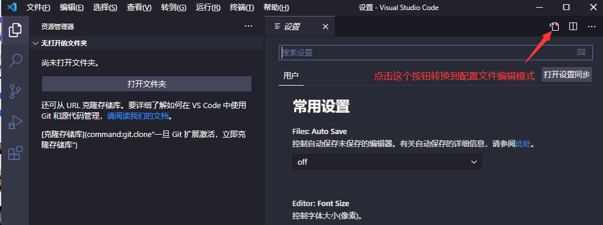
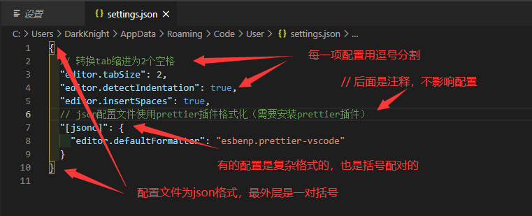
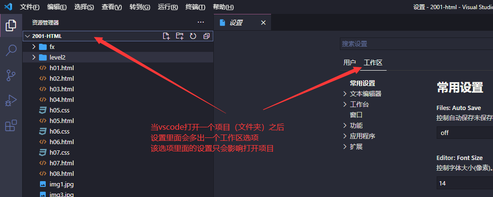

# 配置

- [返回](./README.md)

---

- 全局配置和工作区配置方式

<section class="img-flex-box" >
  <section></section>
  <section></section>
  <section></section>
  <section></section>
</section>

- 一个配置文件示例

```txt
{
  // 搜索排除文件
  "search.exclude": {
    "**/.vscode": true,
    "**/.git": true,
    "**/node_modules": true
  },
  // 不显示的文件
  "files.exclude": {
    "**/.git": true,
    "**/node_modules": true,
    "**/dist": true
  },
  // 当焦点离开时自动保存
  "files.autoSave": "onFocusChange",
  // 转换tab缩进为2个空格
  "editor.tabSize": 2,
  "editor.detectIndentation": true,
  "editor.insertSpaces": true,
  // html单行最大字符数量，配合prettier.htmlWhitespaceSensitivit配置可以避免较长的代码出现结束标签断行
  "html.format.wrapLineLength": 400,
  "prettier.htmlWhitespaceSensitivity": "strict",
  // 散文换行配置
  "prettier.proseWrap": "preserve",
  // javascript字符串变单引号（需要安装prettier插件）
  "prettier.singleQuote": true,
  // javascript行尾自动分号（需要安装prettier插件）
  "prettier.semi": true,
  // json项后面自动补逗号
  "prettier.trailingComma": "es5",
  // 换行符：crlf为windows平台，考虑跨平台可以修改了lf
  "prettier.endOfLine": "crlf",
  // html使用内置格式化功能
  "[html]": {
    "editor.defaultFormatter": "vscode.html-language-features"
  },
  // css文件格式化功能为prettier（需要安装prettier插件）
  "[css]": {
    "editor.defaultFormatter": "esbenp.prettier-vscode"
  },
  // javascript使用prettier格式化功能（需要安装prettier插件）
  "[javascript]": {
    "editor.defaultFormatter": "esbenp.prettier-vscode"
  },
  // json使用prettier格式化功能（需要安装prettier插件）
  "[json]": {
    "editor.defaultFormatter": "esbenp.prettier-vscode"
  },
  // vue文件格式化为prettier（需要安装prettier插件）
  "[vue]": {
    "editor.defaultFormatter": "esbenp.prettier-vscode"
  },
  // md文件格式化配置（需要安装markdown-all-in-one插件）
  "[markdown]": {
    "editor.defaultFormatter": "yzhang.markdown-all-in-one"
  },
  // json格式配置文件格式化功能为prettier（需要安装prettier插件）
  "[jsonc]": {
    "editor.defaultFormatter": "esbenp.prettier-vscode"
  },
  // 关闭插件推荐提醒
  "extensions.ignoreRecommendations": true,
  // Dracula颜色主题设置（需要安装Dracula Official插件）
  "workbench.colorTheme": "Dracula",
  // 文件图标主题设置（需要安装VSCode Great Icons插件）
  "workbench.iconTheme": "vscode-great-icons",
  // 启动时不要显示欢迎页也打开编辑页
  "workbench.startupEditor": "none",
}
```

---

- [配置](#配置)

<!-- js处理背景和css样式 -->
<script type="module" src="https://huhuiyu.top/js/github.js"></script>
