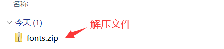
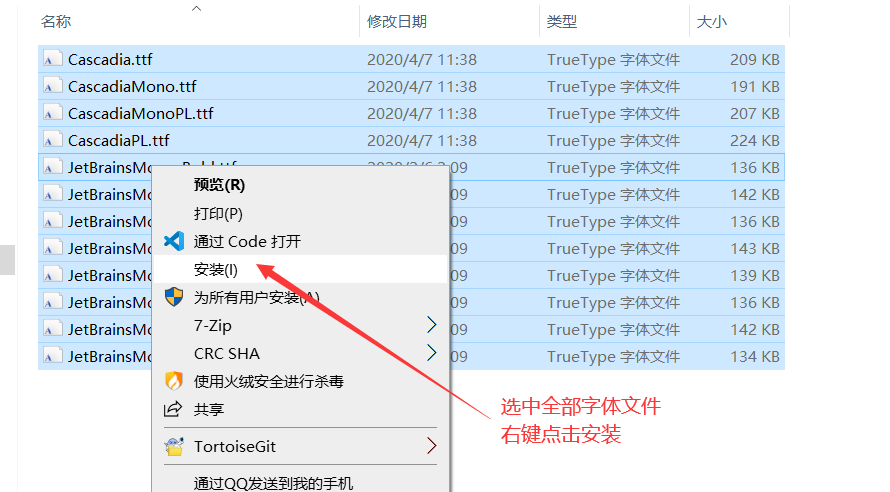
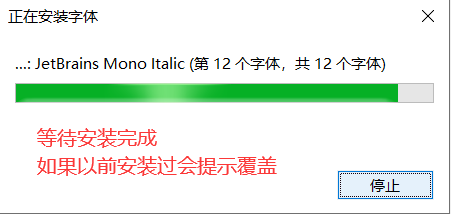
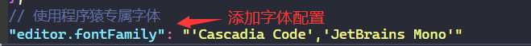
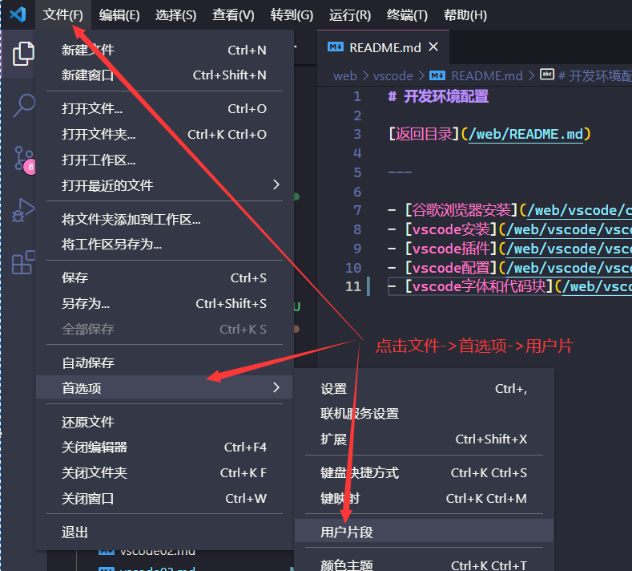
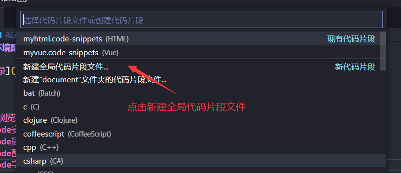
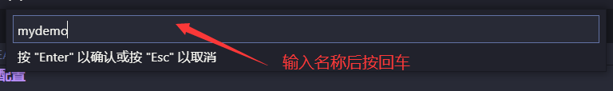
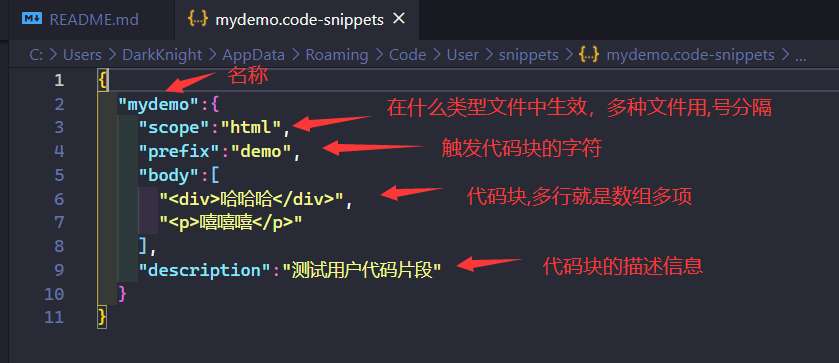
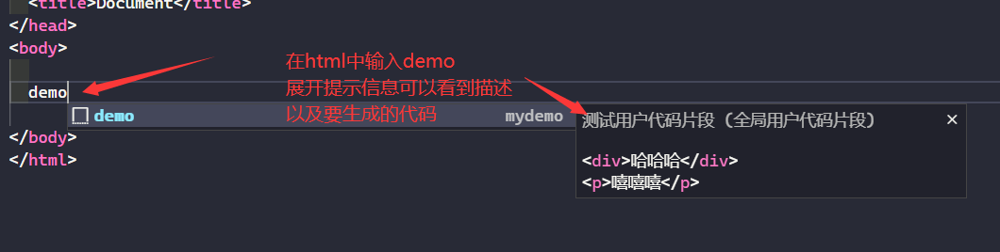
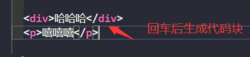

# 配置字体和代码模板

- [返回](./README.md)

---

- 字体配置
  - [下载字体文件](https://media.huhuiyu.top/download/fonts.zip)

<section class="img-flex-box" >
  <section></section>
  <section></section>
  <section></section>
  <section></section>
</section>

- 代码块配置

<section class="img-flex-box" >
  <section></section>
  <section></section>
  <section></section>
  <section></section>
  <section></section>
  <section></section>
</section>

---

- [配置字体和代码模板](#配置字体和代码模板)

<!-- js处理背景和css样式 -->

