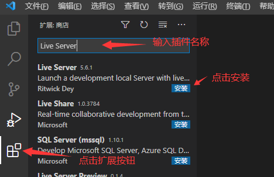
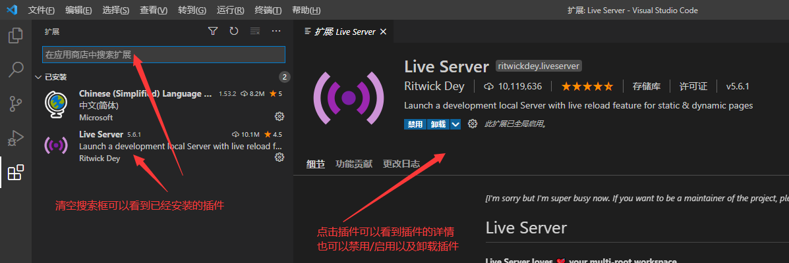

# 插件

- [返回](./README.md)
- [插件](#插件)
  - [英文状态下安装插件](#英文状态下安装插件)
  - [中文状态下安装插件](#中文状态下安装插件)
  - [插件列表](#插件列表)

## 英文状态下安装插件

---

## 中文状态下安装插件

---

## 插件列表

- 常用插件
  - `Chinese (Simplified) Language Pack for Visual Studio Code`：简体中文界面
  - `Live Server`：html开发本地服务器（方便开发效果预览）
  - `HTML CSS Support`：html中的css类名称提示
  - `Auto Rename Tag`：html成对标签自动修改
  - `indent-rainbow`：html标签匹配高亮显示
  - `Prettier - Code formatter`：代码格式化（细节需要自行配置）
  - `Dracula Official`：一个好看的主题
  - `VSCode Great Icons`：一套好看的图标
- Markdown
  - `Markdown All in One`：Markdown文件编写插件
  - `markdownlint`：Markdown语法检测插件
  - `Markdown Preview Enhanced`：Markdown文件效果预览
- vue
  - `Vetur`：vue2插件（和下面的Volar只能启用一个）
  - `Vue Language Features (Volar)`：vue3插件（和上面的Vetur只能启用一个）
- 其它
  - `filesize`：文件大小显示
  - `Git Graph`：git信息图形显示

- [返回](./README.md)
