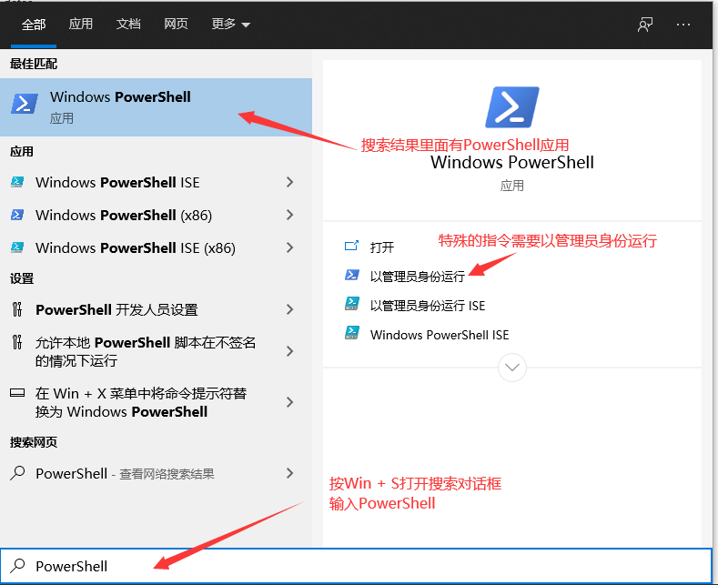
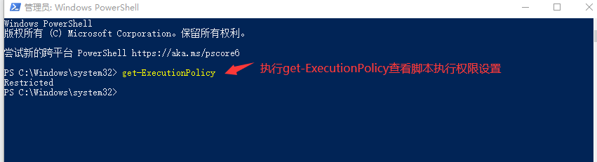
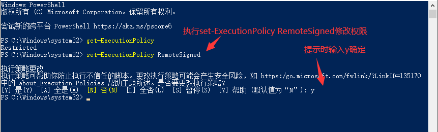
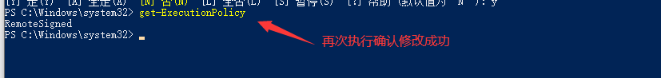
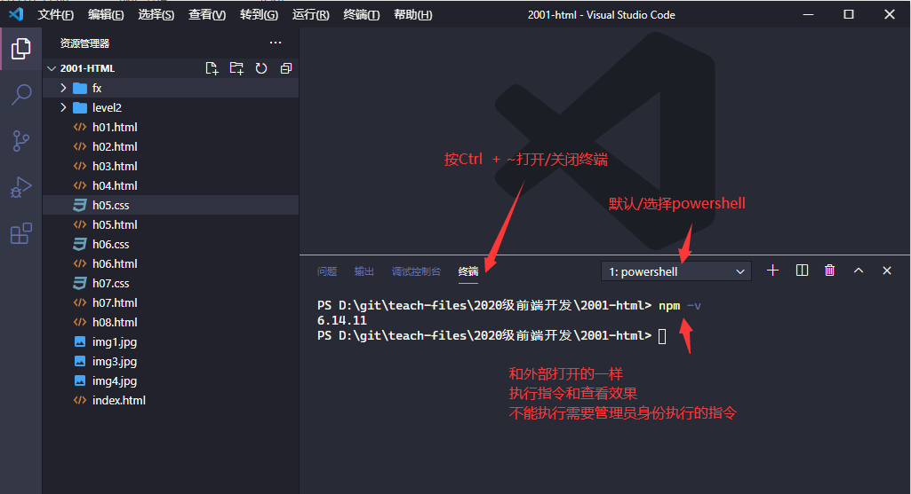

# PowerShell配置

- [返回目录](./README.md)

---

<section class="img-flex-box" >
  <section></section>
  <section></section>
  <section></section>
  <section></section>
  <section></section>
</section>

- 为啥要配置：vue脚手架需要执行shell脚本
- 权限配置语句需要管理员身份执行
- 图中的指令
  - `get-ExecutionPolicy`查看执行脚本的权限
  - `set-ExecutionPolicy RemoteSigned`修改权限
- 一些简单的指令
  - `盘符:`：切换命令所在盘，例如`d:`
  - `pwd`：显示当前所在文件路径
  - `start .`：打开当前所在文件路径
  - `ls`：查看当前路径中的文件/文件夹列表
  - `cd 文件完整绝对路径/相对路径`：切换当前所在文件路径，例如`cd vue-project`或者`cd c:\windows`，目录不存在会提示错误

---

- [PowerShell配置](#powershell配置)

<!-- js处理背景和css样式 -->

