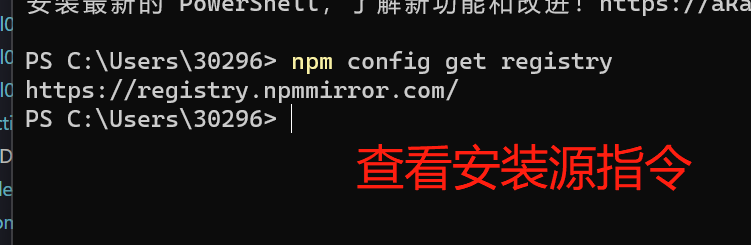
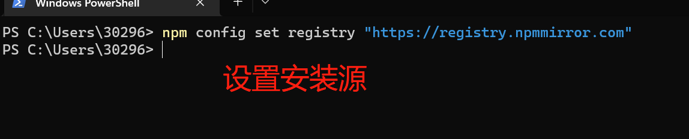

# nodejs配置安装源

[返回目录](./README.md)

---

<section class="img-flex-box" >
  <section></section>
  <section></section>
</section>

- 为什么要切换安装源，国内的安装源速度更快
- 使用第一个方式切换安装源更简单
- 图中的命令
  - `npm config get registry`查看安装源
  - `npm config set registry "https://registry.npmmirror.com"`设置成阿里的安装源

---

- [nodejs配置安装源](#nodejs配置安装源)

<!-- js处理背景和css样式 -->

