# vuecli创建vue2.x带路由的模板项目

- [返回目录](./README.md)

---
- [vuecli创建vue2.x带路由的模板项目](#vuecli创建vue2x带路由的模板项目)
  - [创建过程演示](#创建过程演示)
  - [配置过程演示](#配置过程演示)

## 创建过程演示

<section class="img-flex-box" >
  <section>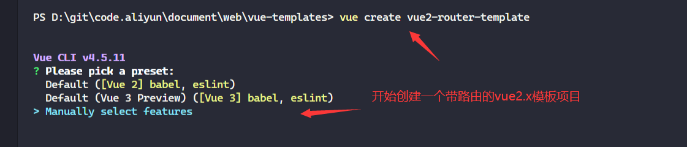</section>
  <section>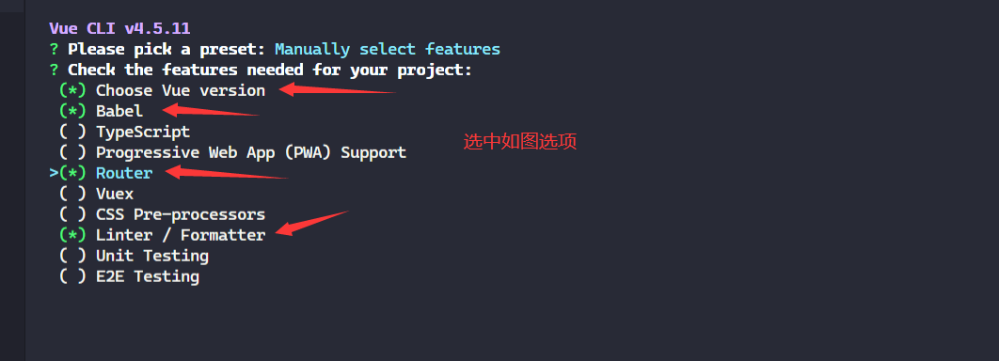</section>
  <section>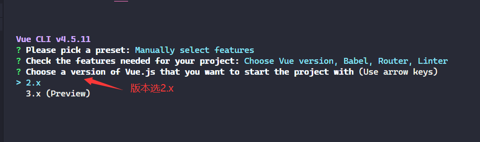</section>
  <section></section>
  <section>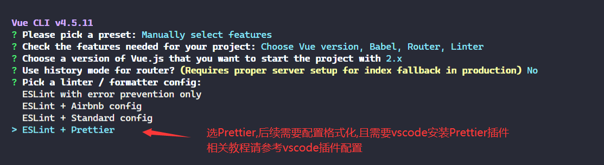</section>
  <section>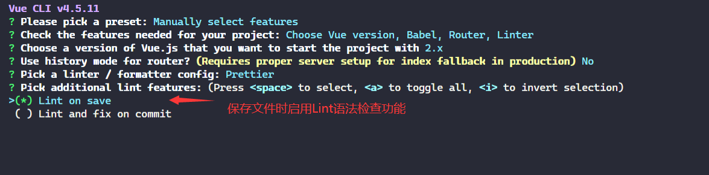</section>
  <section>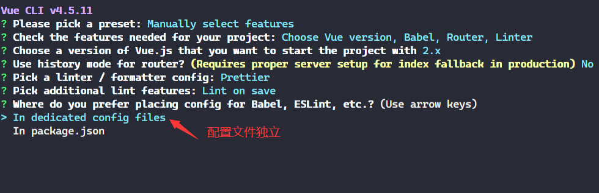</section>
  <section>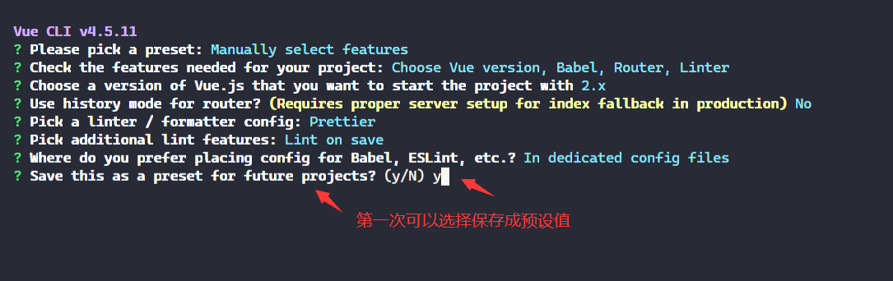</section>
  <section>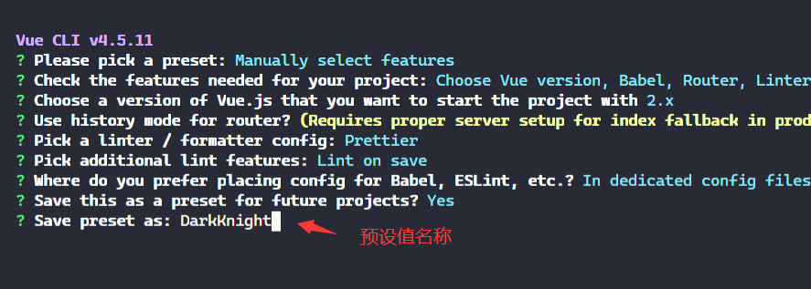</section>
  <section>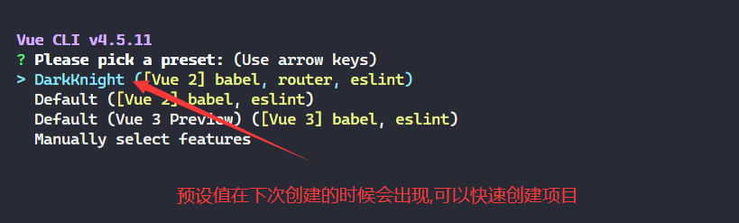</section>
  <section>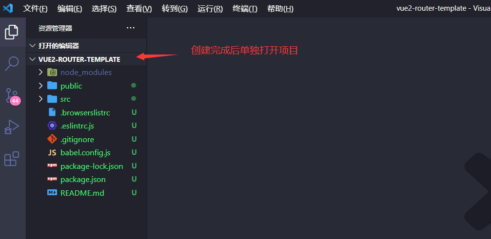</section>
</section>

- [vuecli创建vue2.x带路由的模板项目](#vuecli创建vue2x带路由的模板项目)
  - [创建过程演示](#创建过程演示)
  - [配置过程演示](#配置过程演示)

## 配置过程演示

<section class="img-flex-box" >
  <section></section>
  <section></section>
  <section>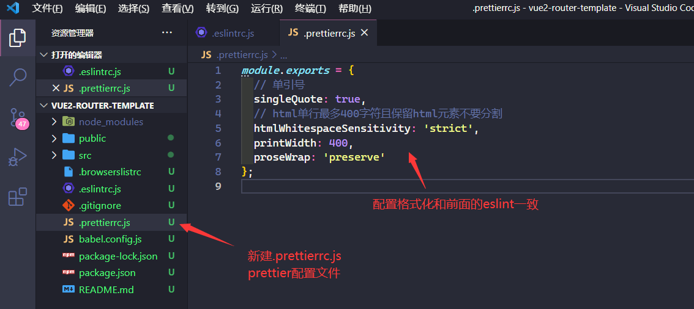</section>
  <section>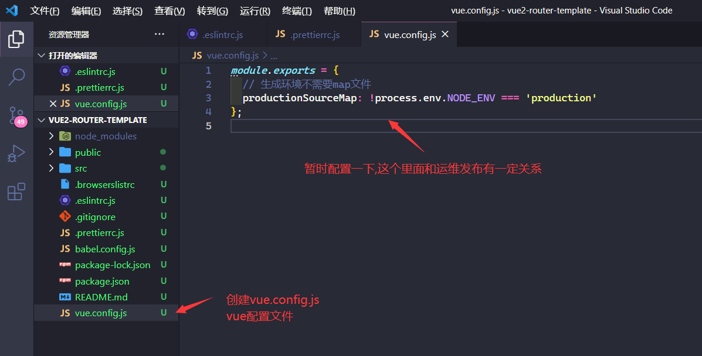</section>
  <section>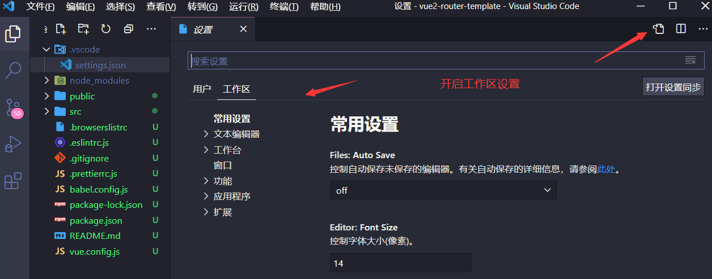</section>
  <section>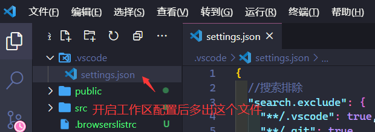</section>
  <section>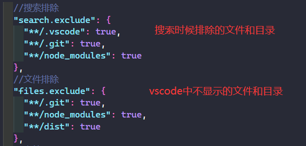</section>
  <section>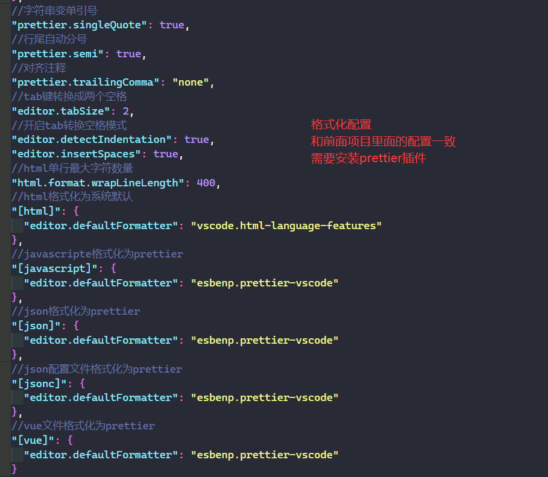</section>
  <section>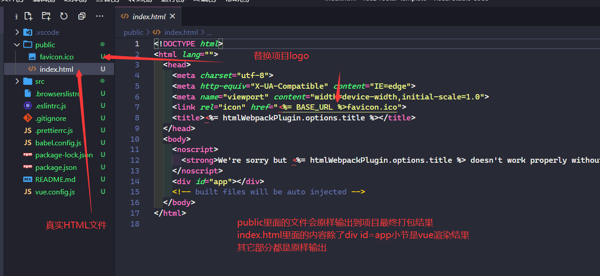</section>
  <section>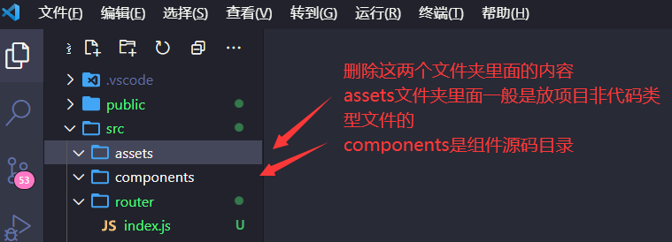</section>
  <section>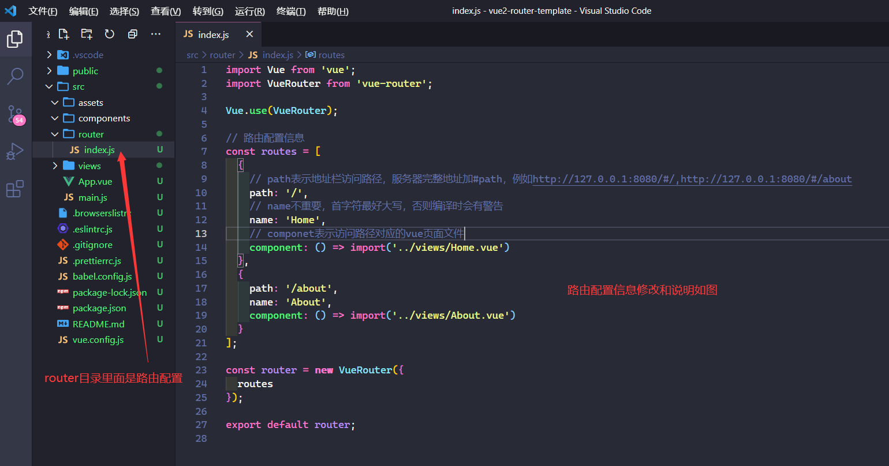</section>
  <section>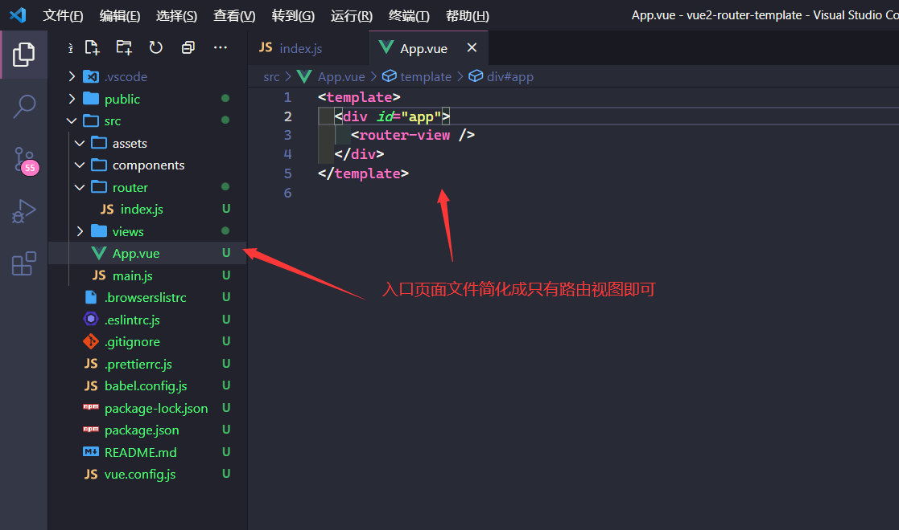</section>
  <section>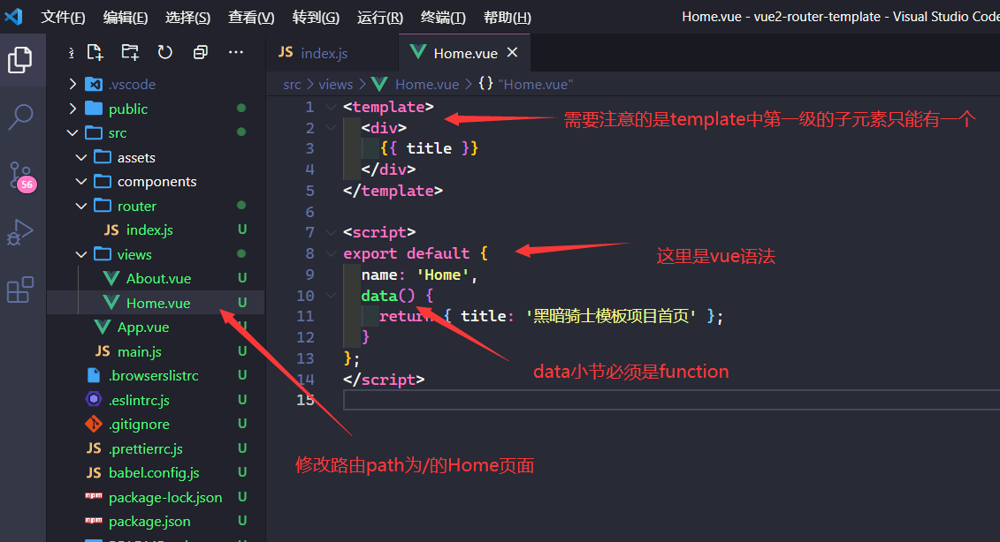</section>
  <section>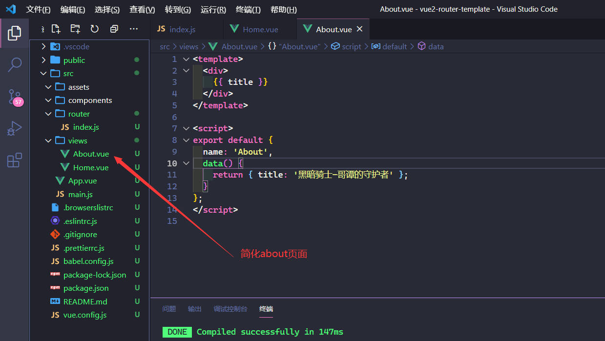</section>
  <section>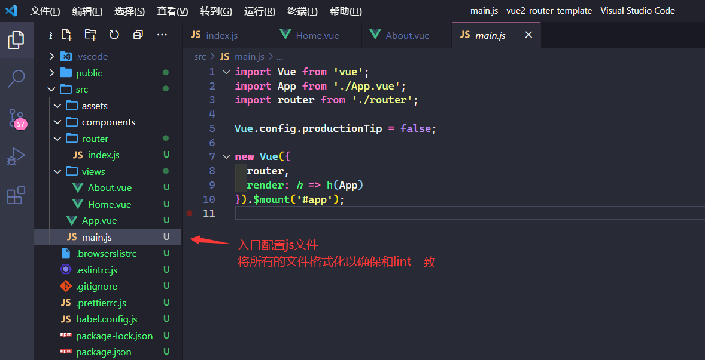</section>
  <section>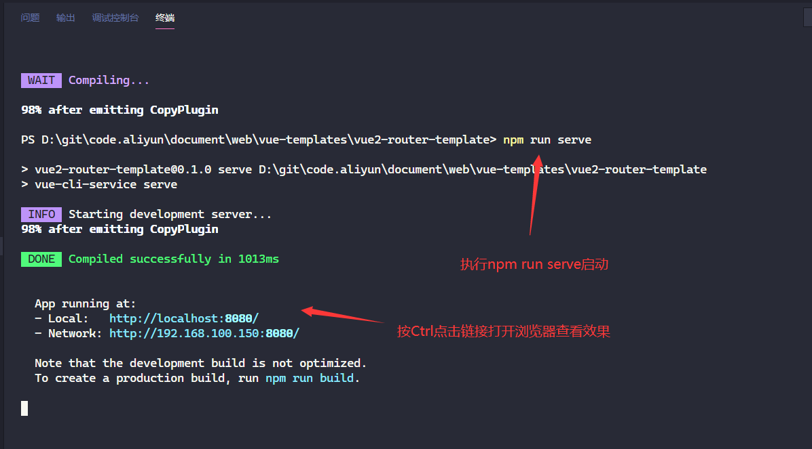</section>
  <section>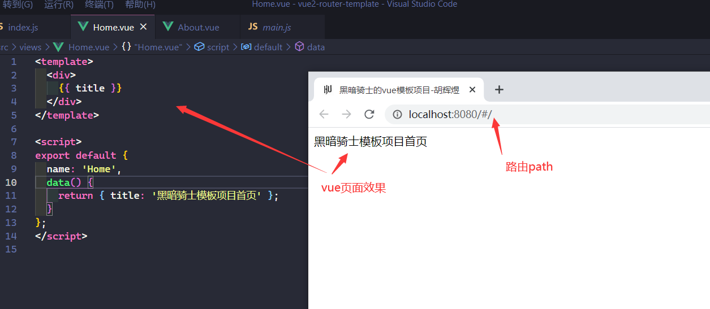</section>
  <section>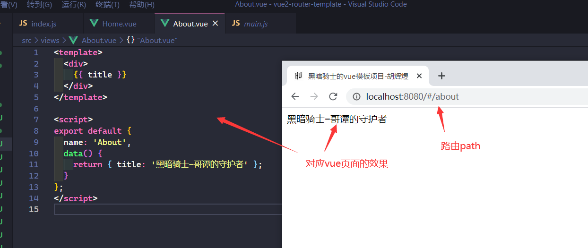</section>
</section>

- [vuecli创建vue2.x带路由的模板项目](#vuecli创建vue2x带路由的模板项目)
  - [创建过程演示](#创建过程演示)
  - [配置过程演示](#配置过程演示)

<!-- js处理背景和css样式 -->

