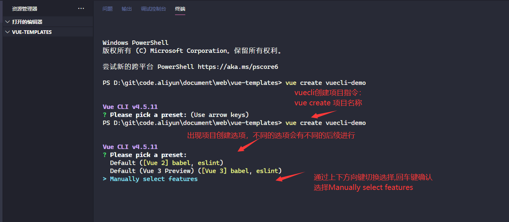
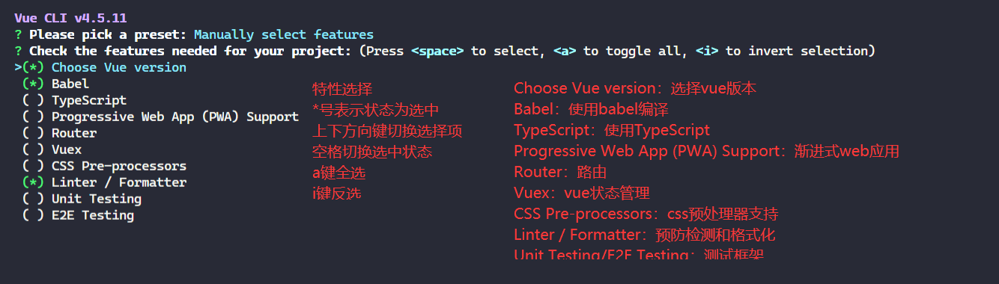
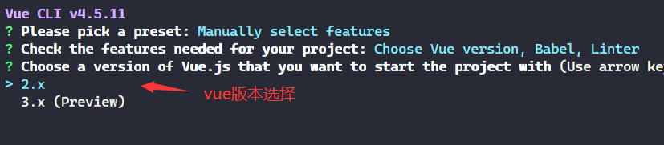
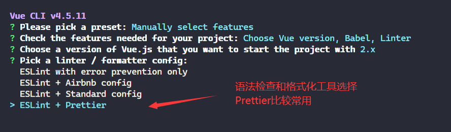
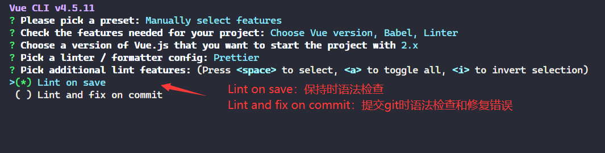
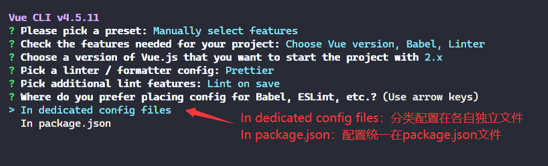
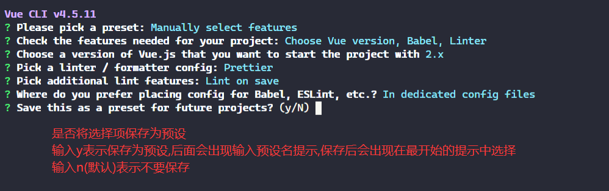
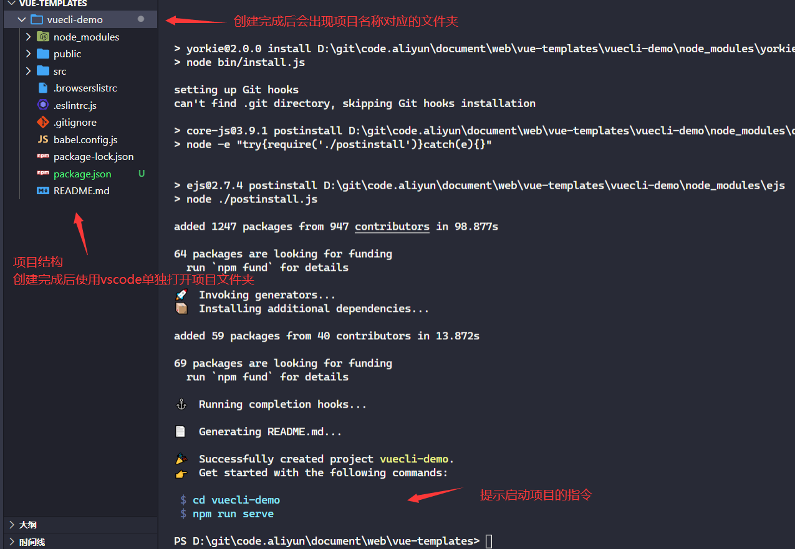
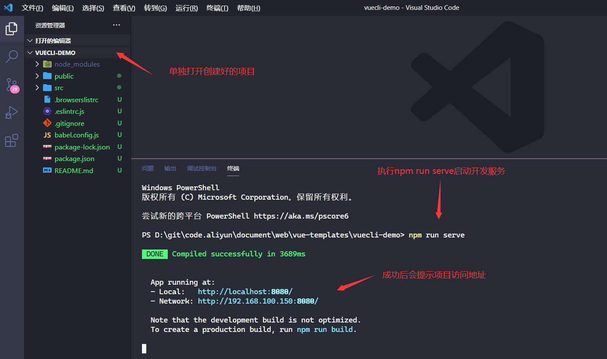

# vuecli基础

- [返回目录](./README.md)

---

<section class="img-flex-box" >
  <section></section>
  <section></section>
  <section></section>
  <section></section>
  <section></section>
  <section></section>
  <section></section>
  <section></section>
  <section></section>
  <section></section>
</section>

---

- [vuecli基础](#vuecli基础)

<!-- js处理背景和css样式 -->

