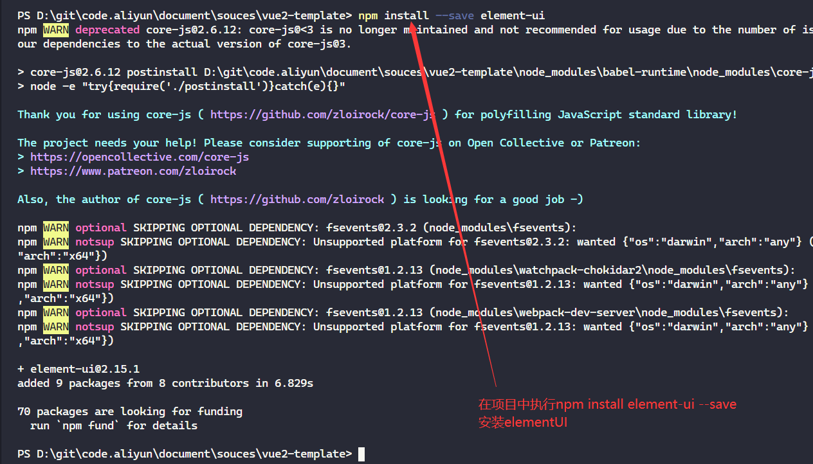
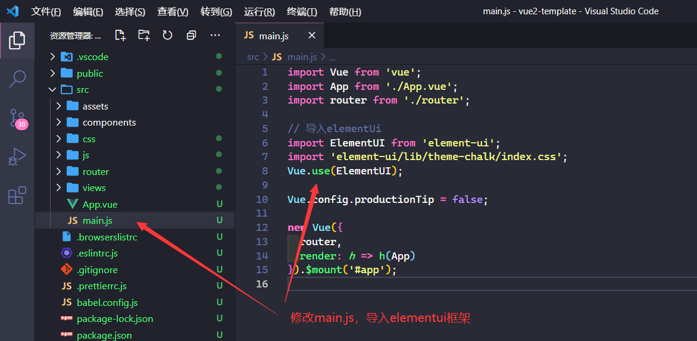
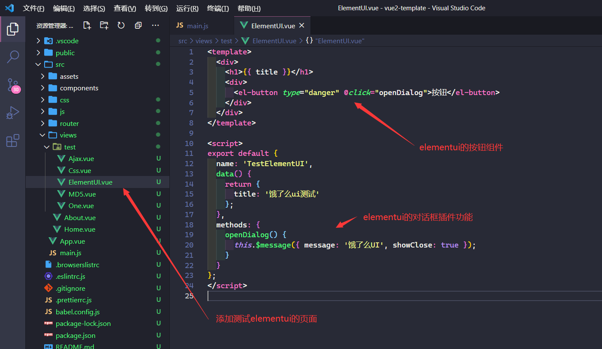
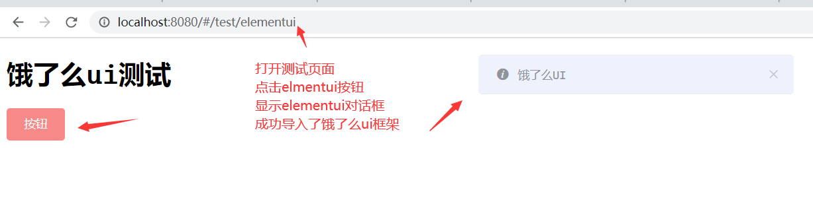

# vuecli导入elementUI

- [返回目录](./README.md)

---

[饿了么ui官方网站](https://element.eleme.cn/#/zh-CN)

<section class="img-flex-box" >
  <section></section>
  <section></section>
  <section></section>
  <section></section>
</section>

---

- [vuecli导入elementUI](#vuecli导入elementui)

<!-- js处理背景和css样式 -->

