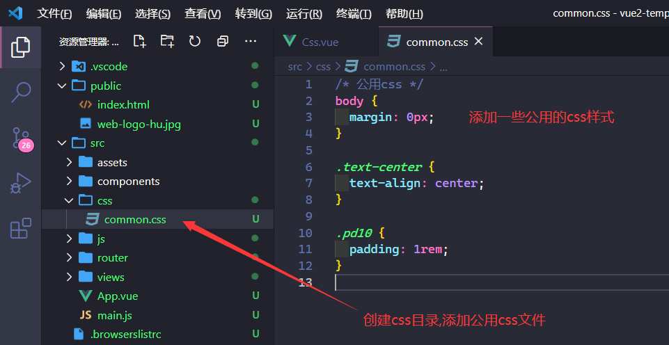
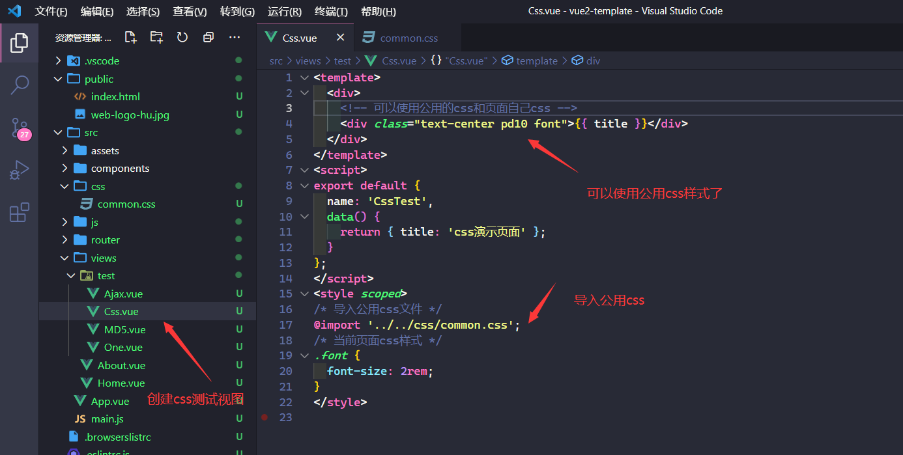
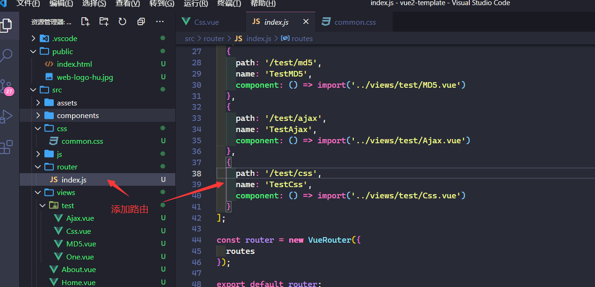
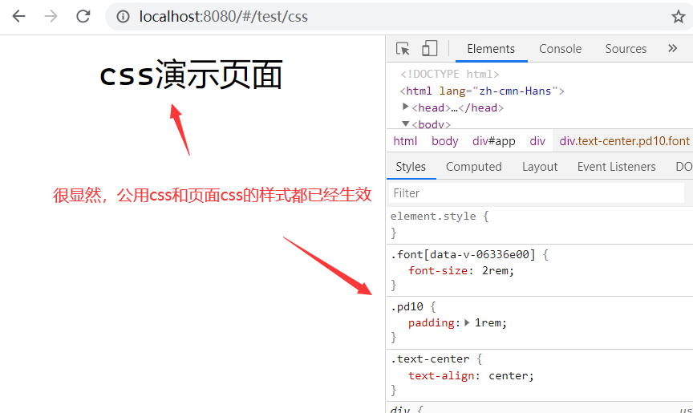
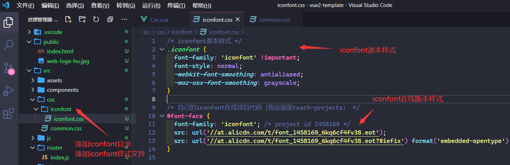
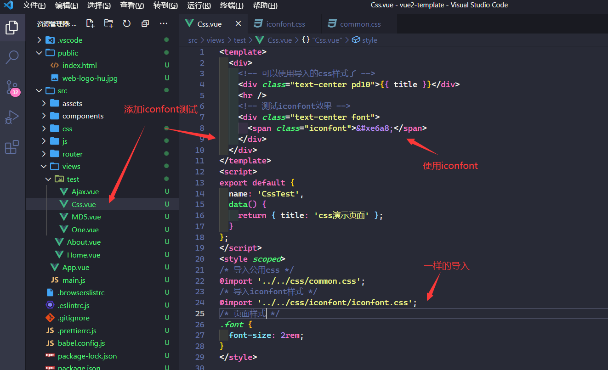
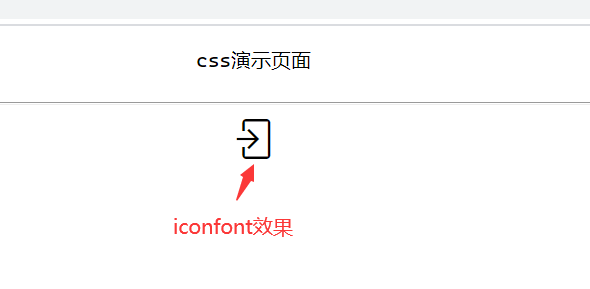
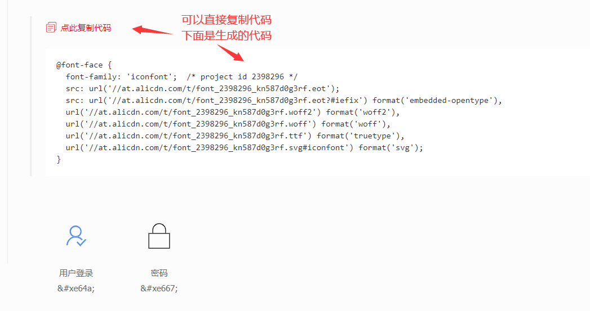
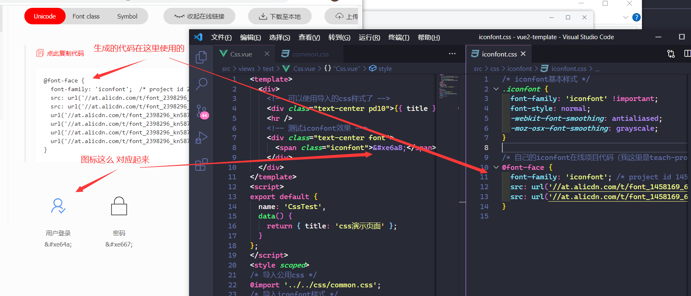

# vuecli导入css

- [返回目录](./README.md)

---

- [vuecli导入css](#vuecli导入css)
  - [公用css导入](#公用css导入)
  - [iconfont知识](#iconfont知识)

## 公用css导入

<section class="img-flex-box" >
  <section></section>
  <section></section>
  <section></section>
  <section></section>
  <section></section>
  <section></section>
  <section></section>
</section>

## iconfont知识

- [iconfont官方网站](https://www.iconfont.cn/)

<section class="img-flex-box" >
  <section></section>
  <section></section>
  <section></section>
  <section></section>
  <section></section>
  <section></section>
  <section></section>
  <section></section>
  <section></section>
  <section></section>
  <section></section>
  <section></section>
</section>

---

- [vuecli导入css](#vuecli导入css)
  - [公用css导入](#公用css导入)
  - [iconfont知识](#iconfont知识)

<!-- js处理背景和css样式 -->

