# vuecli导入js

- [返回目录](./README.md)

---

- [vuecli导入js](#vuecli导入js)
  - [自定义js导入](#自定义js导入)
  - [导入第三方js](#导入第三方js)
  - [简单封装ajax](#简单封装ajax)
  - [图中的一些指令和核心代码](#图中的一些指令和核心代码)

## 自定义js导入

<section class="img-flex-box" >
  <section>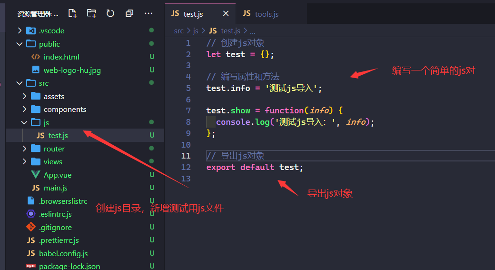</section>
  <section>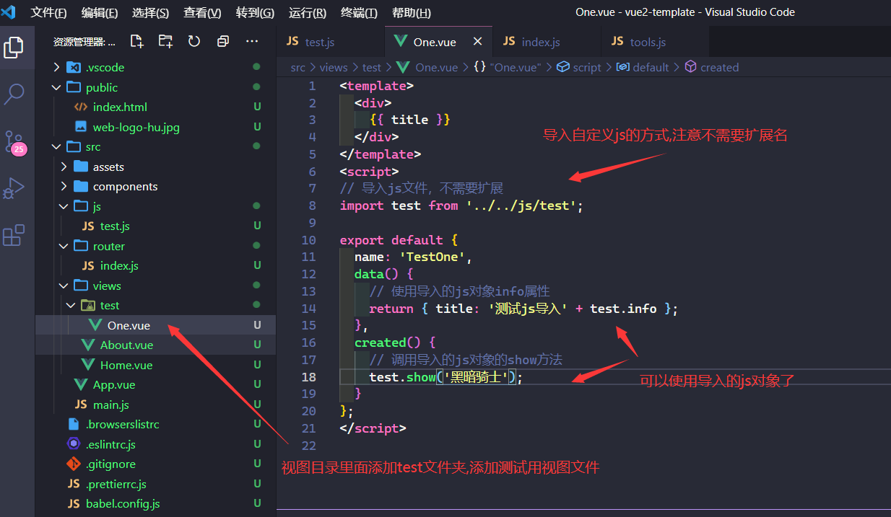</section>
  <section>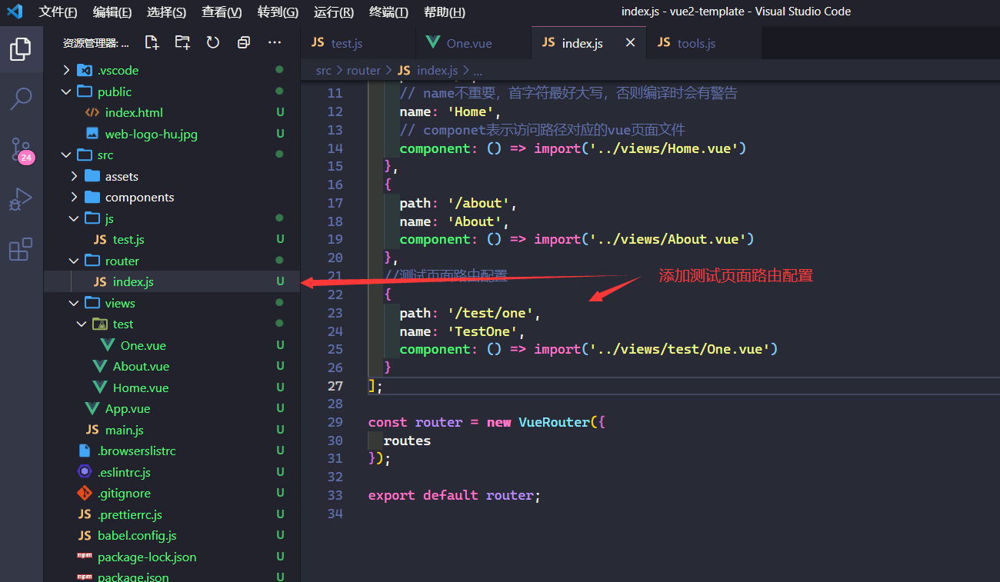</section>
  <section>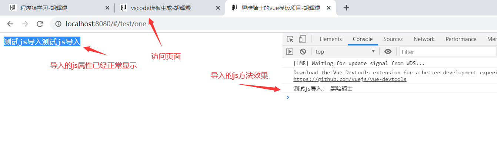</section>
</section>

## 导入第三方js

<section class="img-flex-box" >
  <section>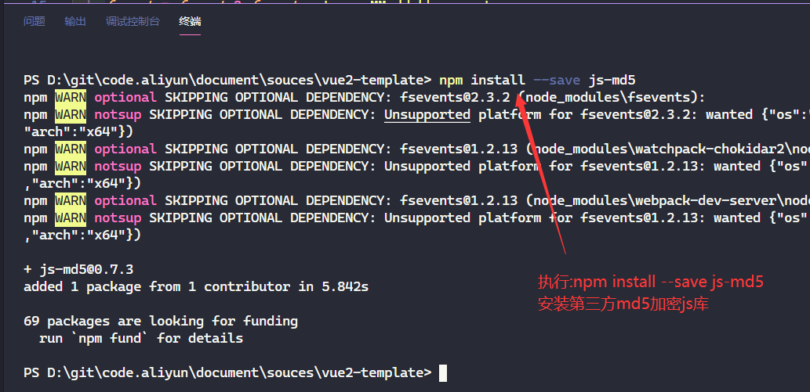</section>
  <section>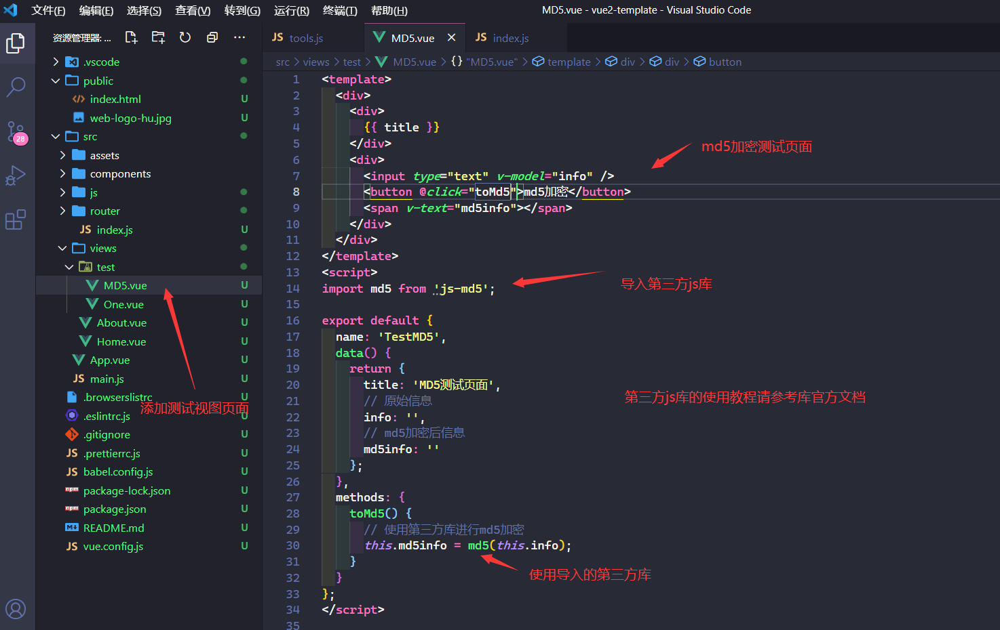</section>
  <section>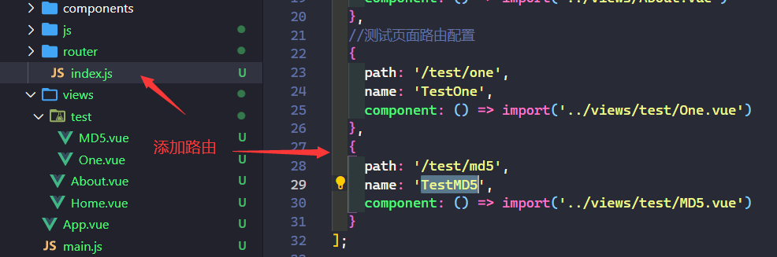</section>
  <section>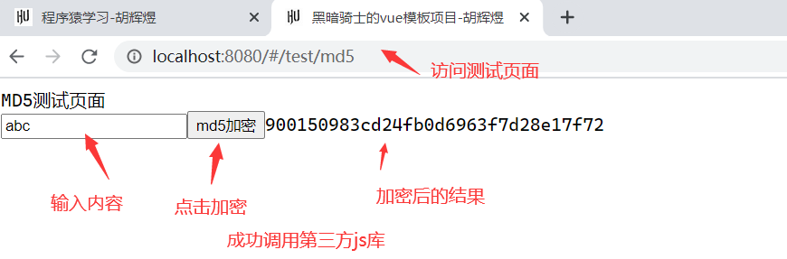</section>
</section>

## 简单封装ajax

<section class="img-flex-box" >
  <section>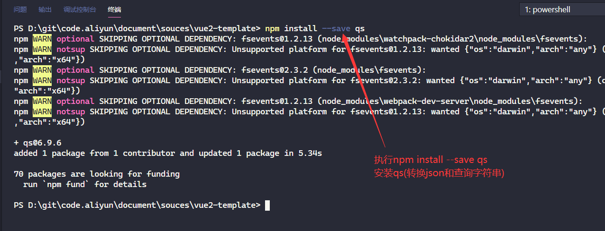</section>
  <section>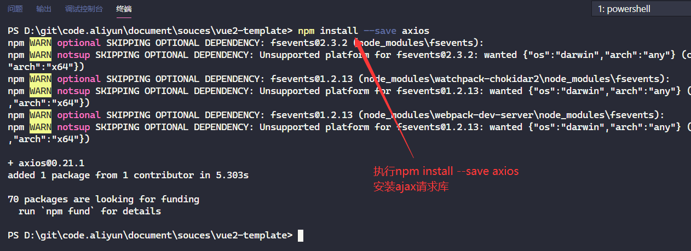</section>
  <section>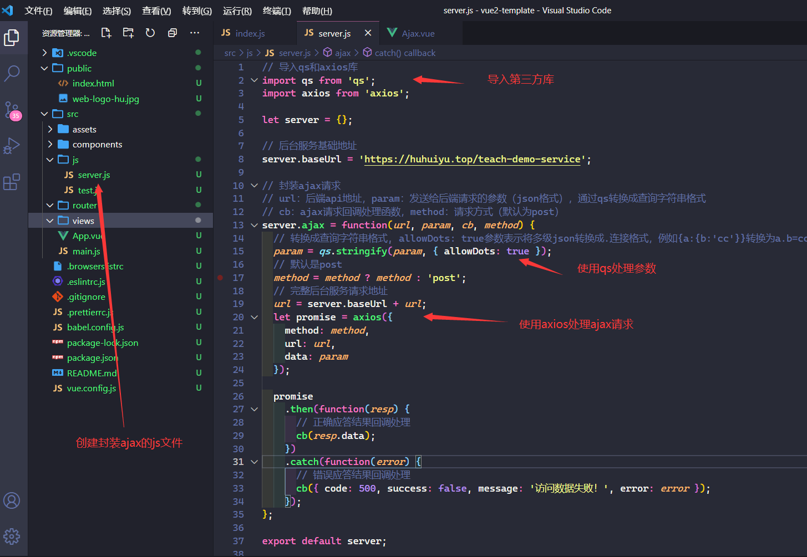</section>
  <section></section>
  <section>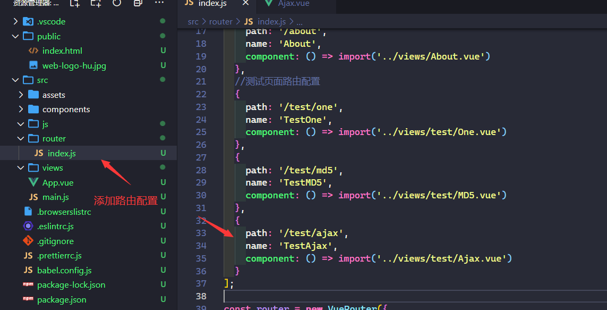</section>
  <section>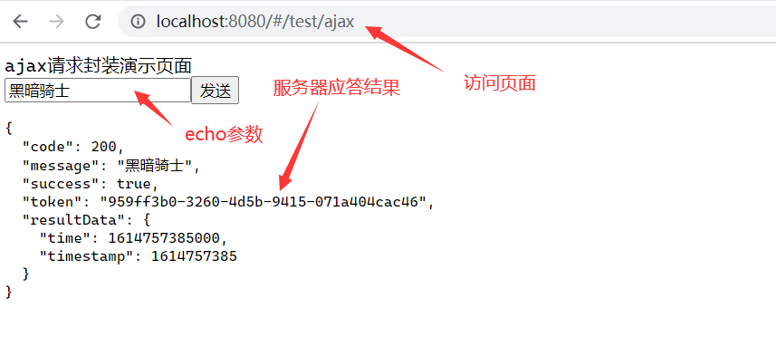</section>
</section>

## 图中的一些指令和核心代码

- md5加密：`npm install --save js-md5`
- json和query字符串转换：`npm install --save qs`
- ajax框架axios：`npm install --save axios`
- ajax封装代码

```js
// 导入qs和axios库
import qs from 'qs';
import axios from 'axios';

let server = {};

// 后台服务基础地址
server.baseUrl = 'https://huhuiyu.top/teach-demo-service';

// 封装ajax请求
// url：后端api地址，param：发送给后端请求的参数（json格式），通过qs转换成查询字符串格式
// cb：ajax请求回调处理函数，method：请求方式（默认为post）
server.ajax = function(url, param, cb, method) {
  // 转换成查询字符串格式, allowDots: true参数表示将多级json转换成.连接格式，例如{a:{b:'cc'}}转换为a.b=cc
  param = qs.stringify(param, { allowDots: true });
  // 默认是post
  method = method ? method : 'post';
  // 完整后台服务请求地址
  url = server.baseUrl + url;
  let promise = axios({
    method: method,
    url: url,
    data: param
  });

  promise
    .then(function(resp) {
      // 正确应答结果回调处理
      cb(resp.data);
    })
    .catch(function(error) {
      // 错误应答结果回调处理
      cb({ code: 500, success: false, message: '访问数据失败！', error: error });
    });
};

export default server;
```

---

- [vuecli导入js](#vuecli导入js)
  - [自定义js导入](#自定义js导入)
  - [导入第三方js](#导入第三方js)
  - [简单封装ajax](#简单封装ajax)
  - [图中的一些指令和核心代码](#图中的一些指令和核心代码)

<!-- js处理背景和css样式 -->
<script type="module" src="https://huhuiyu.top/js/github.js"></script>
