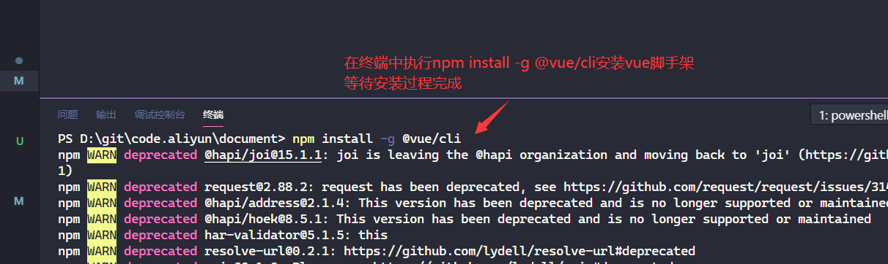
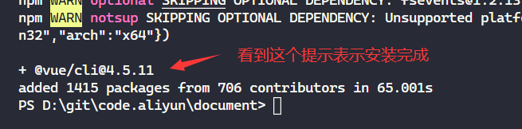
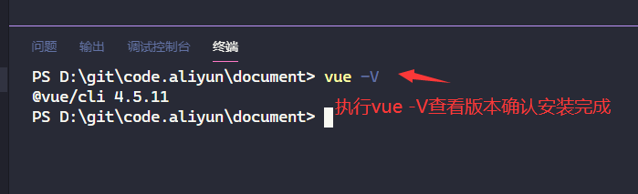

# vuecli安装

- [返回目录](./README.md)

---

<section class="img-flex-box" >
  <section></section>
  <section></section>
  <section></section>
</section>

- 说明
  - [vuecli官方网站](https://cli.vuejs.org/zh/)
  - `npm install -g @vue/cli`：全局安装vue脚手架（成功后不需要反复安装）
  - `vue -V`：查看vue脚手架版本

---

- [vuecli安装](#vuecli安装)

<!-- js处理背景和css样式 -->

